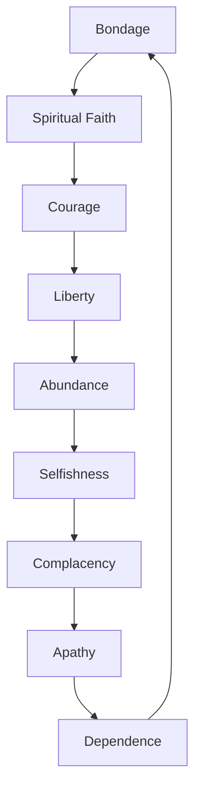

Many people have forgotten about [the Great Depression](https://en.wikipedia.org/wiki/Great_Depression). This is unfortunate because the lost arts of modesty, saving and skepticism have passed with the last generation. A time has gone in America since great strides have been made. Now, since 2001, there is question of when America will again make progress. Please consider the [Tytler Cycle](https://www.google.com/search?client=safari&rls=en&q=tytler&ie=UTF-8&oe=UTF-8):

Some people have started to compare the current recession to the Great Depression ([1](https://www.forbes.com/2009/10/29/depression-recession-gdp-imf-milton-friedman-opinions-columnists-bruce-bartlett.html), [2](https://money.cnn.com/news/storysupplement/economy/recession_depression/), [3](https://krugman.blogs.nytimes.com/2009/03/20/the-great-recession-versus-the-great-depression)). Many of these people are making comparisons based on their own subjective claims, or worse. My research in this article is to present you with a view of primary sources from the depression (page scans from the New York Times at various dates) which show analysis, politicking, and misguided attempts to handle the situation, ultimately leading to failure and World War II. Some commentary is provided, but I strongly encourage the reader to read these, and other, pages of primary text -- and then compare this to what is available in the media today -- so you can make your own opinion. The work here is from myself and [Ms. Wen Yen Chiu](https://www.wretch.cc/blog/miae) (which I recently found out, should really be spelled "Qiu").

October 30th, 1929

> "Bank and Trust Prices Tumble in Record Trading"
>
> "Time to Buy Stocks Says Raskob; Sees Only Temporary Effect on Business"
>
> - New York Times, October 30th, 1929, p. 2

> Insurance Heads Urged to Buy Stocks
>
> Prompted by the drastic readjustment of securities prices, Albert Conway, State Superintendent of Insurance, recommended yesterday to insurance companies the purchase of leading common stocks. At the same time, he called into conference the heads of the largest life insurance companies in the State to see if there was any way in which, under the laws, they could make such purchases.
>
> - *New York Times*, October 30th, 1929, p. 3

19291030p1
To properly read this quote, a person from the modern days must realize that in the past banks and insurance companies were separate entities. Please read these pages to see other cases of optimism and take in a feel of which parties are saying what, then compare to the DJIA during the period. The date of that article is highlighted. Of course, the [S&P 500 would have been a better index](https://fulldecent.blogspot.com/2008/09/where-do-you-get-your-finance-news-why.html), but it didn't exist back then.

June 30th, 1930

> Chain Store Taxes
>
> The almost unanimous vote by which a tax on chain stores was passed by the Alabama House of Representatives reflects a trend which seems to be gathering momentum. The recent ruling of the Supreme Court upholding the validity of such a tax in Indiana has apparently emphasized to State Assemblies that there is a source of revenue which may lighten the burdens of the home taxpayer. On the face of it such a tax is on a foreign corporation. The wide distribution of chain store shares, however, may have been overlooked by some of the interests sponsoring such bills.
>
> - New York Times, June 30th 1903

Globalization is a much more delicate issue today and "us versus them" taxes would be presented and received in a different light than yesteryear.

April 6, 1933

The main headline of the day was "Beer Is Legal At Midnight; Brewers To Ban 'Carnival'". Also, here is a complete list of headlines on page 2:

> Planes, as "Brewery Horses," Will Rush Beer to Roosevelt
>
> Jersey Beer Bill Signed In Hoboken
>
> Finns Hail Prohibition Repeal as Success; First Anniversary Finds Less Drunkenness
>
> Repeal Machinery Ready in 25 States
>
> Big Cities Await Beer's Zero Hour
>
> Court Urged to End Brewery Padlock
>
> Appeal in Phoenix Case Based on Legalizing of Beer by Congress

Also on page one is a smaller story, which is continued on page seven, titled "President Invokes Gold Hoarder Law". This is also known as [Executive Order 6102](https://en.wikipedia.org/wiki/Executive_Order_6102).

June 17th, 1933

The main headline was "President Starts Recovery Program, Signs Bank, Rail and Industry Bills; Wheat Growers Will Get $150,000,000." The main article talks about the grand scheme of the federal government's plan to control commerce. Roosevelt's administration claims "Million Jobs by Oct. 1, " and there are comments about central planning for farms:

> The acreage reduction and allotment provisions of the Farm Relief Act will be applied to the wheat crops of 1934 and 1935, and the fund of $150,000,000 will be raised by a processing tax of around 30 cents a bushel levied against milling. By Sept. 15 two-thirds of the $150,000,000 will have been distributed among wheat growers who have complied with the government's terms.
>
> - New York Times, June 17th, 1933 p. 1

To put this into context, here is an overview of unemployment by Linda Levine submitted to the US Congress in June 2009, "The Labor Market during the Great Depression and the Current Recession":

> What commonly is referred to as the Great Depression comprised two downturns in the business cycle. The first recession began in August 1929, and lasted 43 months until March 1933. A sluggish comeback of the economy occurred during the next four years, before the business cycle peaked in May 1937. The subsequent 13-month decline in the economy’s performance ended in June 1938, but employment did not fully recover until the United States entered World War II.
>
> And under the heading "Powers Granted to the President" is a list of what the seventy-third congress ordained on the president. Given the industrial capacity of America at the time, and the level of control enumerated in the article, quoted below, I consider this to be the largest amount of control any one person has had over mankind in Earth's history.
>
> To establish control over all industry with the view to fixing the minimum wages and maximum hours of work, regulating production and otherwise to promote, encourage and require fair competition.
>
> To set up a system of government licenses for business if necessary to require conformance to the above.
>
> To initiate and direct, through a Federal director of public works, a $3,300,000,000 public works program as a further government contribution to re-employment.
>
> To direct, through a Federal director of relief, expenditure of $500,000,000, supplied by the Reconstruction Finance Corporation, for relief of destitution.
>
> To invoke the Presidential powers of the World War to regulate transactions in credit, currency, gold and silver, ever to embargo gold or foreign exchange; to fix restrictions on the banking business of the Federal Reserve System irrespective of the Federal Reserve Board.
>
> To eliminate the old system for compensation and allowances for veterans and set up an entirely new pension system, with himself at the head.
>
> To reduce by executive order the salaries of government employes by an amount not to exceed 15 per cent upon the finding of commensurate reduction in cost of living.
>
> To transfer, eliminate, consolidate or rearrange bureaus in the executive branch of the government in the interest of public economy.
>
> To repeal by executive proclamation certain new taxes voted in Industrial Recovery Act upon showing of restoration of business or in event of repeal of the Eighteenth Amendment.
>
> To publish heretofore secret income tax returns to the extent he may deem in the public interest, and under such rules and regulations as he may prescribe.
>
> To inflate the currency either by requiring open market operations in Federal securities, devaluing the gold dollar by not more than 50 per cent, issuing United States notes up to $3,000,000,000 or accepting up to $200,000,000 in silver in payment of the allied war debts.
>
> To employ more than 250,000 unemployed young men in restoration operations as still further government contribution to re-employment.
>
> To appoint a coordinator of railroads to effect economies among the carriers and increase service to the public.
>
> To appoint a Tennessee Valley Authority to develop natural resources of Tennessee River basin, including completion of Muscle Shoals project.

Don't expect much in the way of a conclusion here. But feel free to post your own comparison of today and then in the comments section below.

IMAGES TO LINK:
