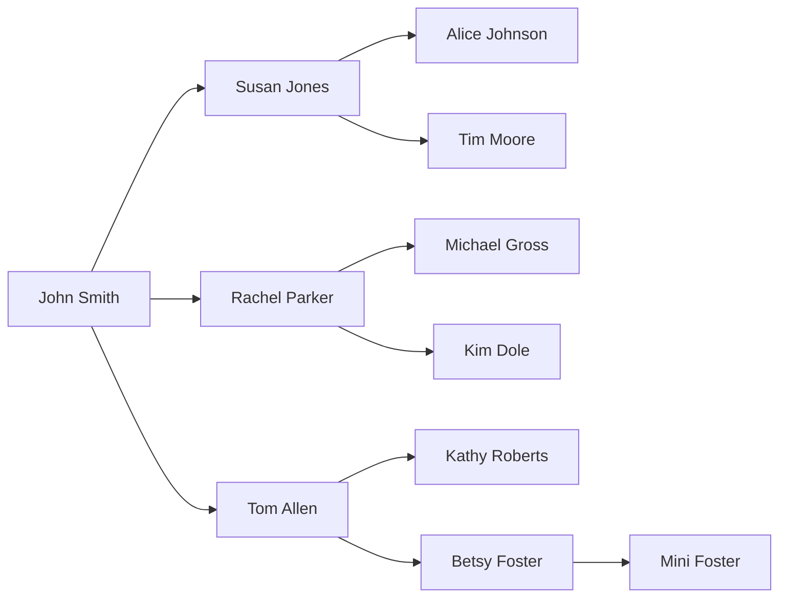

There's lots of Q&A websites out there talking about Excel bugs that are actually formula errors, and others that talk about recursive VLOOKUPs when they really mean iterative. But when I say this, I mean it:

**Excel (2007, 2010, 2011) has an undocumented feature where you can use circular reference in the third argument of `VLOOKUP` without iterative calculation.**

Why should I care? Here's one type of problem you can solve with this "feature". Suppose we have an organizational chart and want to find how many levels deep each person is. Similar to [this problem posted on MrExcel](https://www.mrexcel.com/forum/excel-questions/455301-recursive-hierarchy-problem.html).




| ID | BOSS | NAME          | LEVEL |
| --- | ---- | ------------- | ----- |
| 1   |      | John Smith    | |
| 2   | 1    | Susan Jones   | |
| 3   | 2    | Alice Johnson | |
| 4   | 2    | Tim Moore     | |
| 5   | 1    | Rachel Parker | |
| 6   | 1    | Tom Allen     | |
| 7   | 5    | Michael Gross | |
| 8   | 5    | Kim Dole      | |
| 9   | 6    | Kathy Roberts | |
| 10  | 6    | Betsy Foster  | |
| 11  | 10   | Mini Foster   | |

You can do it with this formula in cell D2:

```excel
=IF(ISBLANK(B2),1,VLOOKUP(B2,A:D,4,FALSE)+1)
```

So what's going on here? For the first row, we have a cop-out, this rule makes LEVEL = 1 for John Smith who has no boss. For the second row `VLOOKUP` finds Susan's boss and then looks up John's LEVEL and adds one.

So that's cute, since the order of operations by default goes from top to bottom, Excel will evaluate the rows above it and find the needed value, right? Wrong. Excel will set its execution order correctly to account for the problem.

| ID | BOSS | NAME          | LEVEL |
| --- | ---- | ------------- | ----- |
| 1   |      | John Smith    | 1     |
| 2   | 1    | Susan Jones   | 2     |
| 3   | 2    | Alice Johnson | 3     |
| 4   | 2    | Tim Moore     | 3     |
| 5   | 1    | Rachel Parker | 2     |
| 6   | 1    | Tom Allen     | 2     |
| 7   | 5    | Michael Gross | 3     |
| 8   | 5    | Kim Dole      | 3     |
| 9   | 6    | Kathy Roberts | 3     |
| 10  | 6    | Betsy Foster  | 3     |
| 11  | 10   | Mini Foster   | 4     |

Now... what if you enter a value that is a legitimate circular reference?

| ID | BOSS | NAME          | LEVEL |
| --- | ---- | ------------- | ----- |
| 1   |      | John Smith    | `=VLOOKUP(1,A:D,4,FALSE)` |

In 2007 and 2010 calculation is halted without an error. In Excel 2011, this throws an error correctly.


So in conclusion, Excel will allow you to evaluate true recursive problems with `VLOOKUP` without resorting to iterative calculation, which nobody wants to use. The engine just works and produces the correct answer if it is mathematically possible.
