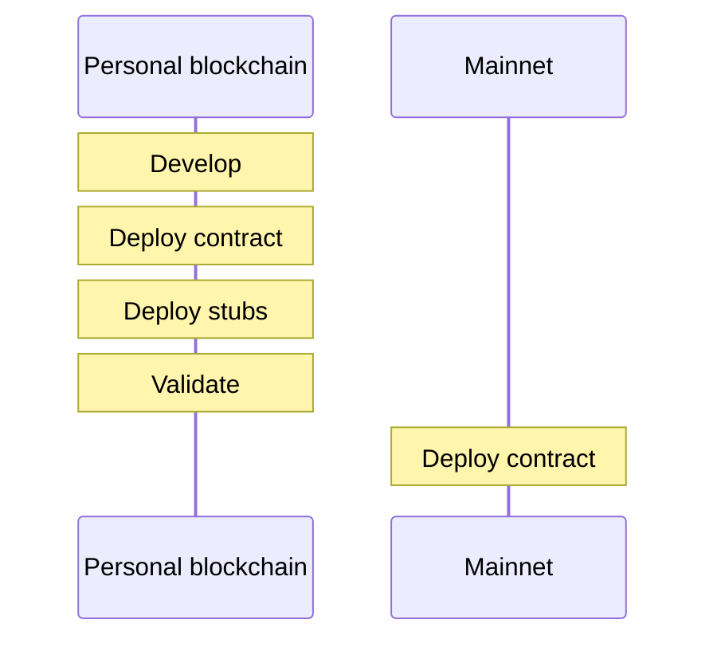
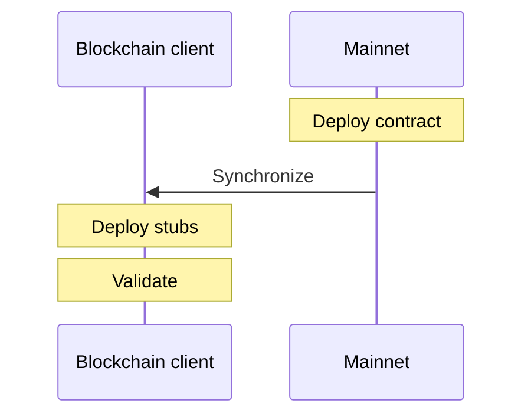
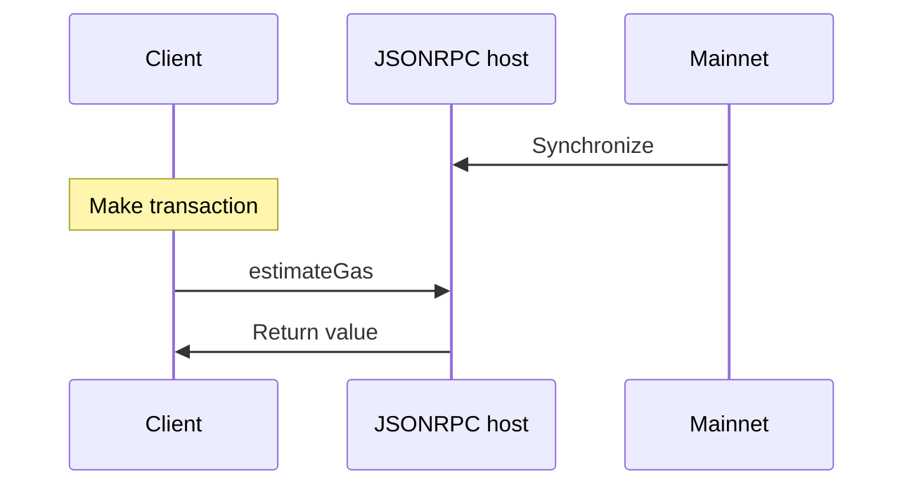

In this article, we will introduce a technique that allows you to test any deployed contract in arbitrary ways, without spending gas. It works on Ethereum Mainnet, Wanchain, Ethereum Ropsten, Hyperledger Burrow, Proof of Authority Network, private chains, and every other network based on Ethereum Virtual Machine.

This new technique was first shown with the [ERC-721 Validator](https://erc721validator.org/), and you can't do it with Truffle.

You will want to learn this technique if:

- Your contract deployment is too complicated to use Truffle
- You are testing somebody else's contract, possibly without access to the source code
- You want to batch test deployed contracts, and you don't care how they were deployed
- You are interested in weird stuff and errors in the Ethereum Yellow Paper

## Clean room testing vs. live testing

Most professional smart contract developers will prefer the clean room testing methodology. It is cheap (doesn't spend gas), fast (doesn't wait for transactions), and it makes reproducible results. In combination with Ganache (personal blockchain), Truffle is the best-known tool for this approach:

{: .margin-note}
Clean room testing approach (e.g. Truffle)



Several situations could frustrate your ability to use this technique. For example, your contract may need live test data (not reproducible) to confirm that specific code paths work correctly. Or your deployment process may be too complicated to use Truffle. Or you want to test compatibility with a contract with no source code available. Or more simply, maybe your CEO had you deploy before test cases were finished.

A new methodology, live testing, allows you to perform validation tests on contracts on Mainnet while also having access to all Mainnet data.

{: .margin-note}
Live testing approach



Of course, it is also possible to deploy your stubs to Mainnet. However, this may be unnecessarily expensive and slow. Also note that in this setup, the validation process has full access to all Mainnet contracts and data.

## Testing with a deployed contract

The live testing technique could be performed by deploying a smart contract written explicitly for testing to Mainnet and then calling that contract. Our first example will test whether or not Su Squares (an ERC-721 contract) has a total supply of 10,000 tokens. ([Su Squares](https://etherscan.io/address/0xE9e3F9cfc1A64DFca53614a0182CFAD56c10624F#code) was deployed with, and is intended to always have, precisely 10,000 non-fungible tokens).

Please note that the 10,000 tokens supply test was chosen for its simplicity to demonstrate the technique. The same technique can be used on much more complex tests.

{: .margin-note}
These Solidity examples can be copy-pasted and compiled with [Remix](https://remix.ethereum.org/#optimize=false). Page example uses Web3 and require MetaMask.

```solidity
pragma solidity 0.5.6;
import "https://github.com/0xcert/ethereum-erc721/src/contracts/tokens/erc721-enumerable.sol";
contract SuSquaresTests
{
  ERC721Enumerable testSubject;
  /**
   * @notice Deploy test contract with a subject to be used for all tests.
   */
  constructor(
    address _testSubject
  )
    public
  {
    testSubject = ERC721Enumerable(_testSubject);
  }
  /**
   * @notice Test token supply invariant.
   */
  function testIsTotalSupply10000()
    external
    view
    returns (bool testResult)
  {
    testResult = testSubject.totalSupply() == 10000;
  }
}
```

This contract is already deployed on Mainnet, and you can play with it at [0x37d3bffed6f784d2cb5542bb9d9007c16e5938df](https://etherscan.io/address/0x37d3bffed6f784d2cb5542bb9d9007c16e5938df).

For some good reason, this test performs actions which require changing Mainnet state. Therefore, this test is expensive to deploy and costly to run. Also, it takes time to execute (due to one-block confirmation). Next, we will remove one of these expenses.

## Tests with `estimateGas`

We can remove the cost of executing this test function by using a built-in feature of the standard Ethereum client JSON-RPC (and by extension Web3.js), namely the `estimateGas`. In the diagram below, "Client" refers to a Geth/Parity console session, Truffle or a web browser using web3.js.

{: .margin-note}
The estimateGas workflow between client, JSONRPC host and mainnet



The parameters to [`estimateGas`](https://github.com/ethereum/wiki/wiki/JSON-RPC#eth_estimategas) are equivalent to making a normal transaction except that you do not need to sign it and it returns the amount of gas used. (It is also possible to have a false/failed test result if all gas is used). In simple terms, `estimateGas` does everything exactly the same as making a transaction, but instead of committing the transaction it tells us how much the transaction would cost us.

You should also note that in the case of running `estimateGas` on a transaction that reverts (fails), the returned gas amount will be equal to the total gas available in a block.

With this in mind, we can modify the above test case so that the test result is expressed by the amount of gas used:

```solidity
/**
  * @notice Test token supply invariant.
  */
function testIsTotalSupply10000()
  external
{
  require(testSubject.totalSupply() == 10000);
}
```

In this new version, if the test fails, the gas spent will be the total gas available.

Now we have a way to run arbitrary test cases without having to pay each time we use them. In the next section, we will also remove the expense of deploying the contract. But to proceed, we must violate a statement from the Ethereum Yellow Paper.

## The singleton transaction pattern

The current version of the Ethereum Yellow Paper (the specification which all Ethereum clients should follow) states:

> There are [only] two types of transactions: those which result in message calls and those which result in the creation of new accounts with associated code (known informally as "contract creation").
>
> <footer><a href="https://github.com/ethereum/yellowpaper/blame/master/Paper.tex#L274">Ethereum Yellow Paper</a></footer>

This is actually incorrect since the Ethereum reference implementations we have checked — Geth and Parity and all other implementations we know — all allow a third type of transaction. We will abuse this fact in order to refactor the test contract and immediately perform a test case and return results — without having to actually deploy the contract. How? By moving the test case into the constructor.

```solidity
pragma solidity 0.5.6;
import "https://github.com/0xcert/ethereum-erc721/src/contracts/tokens/erc721-enumerable.sol";
contract SuSquaresTests
{
  /**
   * @notice Deploy test contract with a subject to be used for all tests.
   */
  constructor(
    ERC721Enumerable _testSubject
  )
    public
  {
    testIsTotalSupply10000(_testSubject);
  }
  /**
   * @notice Test token supply invariant.
   */
  function testIsTotalSupply10000(
    ERC721Enumerable _testSubject
  )
    public
  {
    require(_testSubject.totalSupply() == 10000);
  }
}
```

This example has violated the Ethereum Yellow Paper specification because here a transaction that created a contract has also made a message call into that contract. One call can also create multiple contracts and make multiple message calls into those contracts as will be shown in the stubs example later.

You must compile this contract to bytecode, first. Here is how to achieve this with Remix IDE:


```html
<html>
<head>
  <title>Estimate gas tests</title>
</head>
<body>
  <script src="https://cdn.jsdelivr.net/gh/ethereum/web3.js@1.0.0-beta.34/dist/web3.min.js" type="text/javascript"></script>
  <script>
    if (typeof window.web3 !== "undefined" && typeof window.web3.currentProvider !== "undefined") {
      var web3 = new Web3(window.web3.currentProvider);
    } else {
      alert("No web3");
    }
    const abi = [
      {
        "constant": false,
        "inputs": [
          {
            "name": "_testSubject",
            "type": "address"
          }
        ],
        "name": "testIsTotalSupply10000",
        "outputs": [],
        "payable": false,
        "stateMutability": "nonpayable",
        "type": "function"
      },
      {
        "inputs": [
          {
            "name": "_testSubject",
            "type": "address"
          }
        ],
        "payable": false,
        "stateMutability": "nonpayable",
        "type": "constructor"
      }
    ];
    const bytecode = "0x608060405234801561001057600080fd5b5060405160208061021d8339810180604052602081101561003057600080fd5b81019080805190602001909291905050506100508161005660201b60201c565b506100e7565b6127108173ffffffffffffffffffffffffffffffffffffffff166318160ddd6040518163ffffffff1660e01b815260040160206040518083038186803b15801561009f57600080fd5b505afa1580156100b3573d6000803e3d6000fd5b505050506040513d60208110156100c957600080fd5b8101908080519060200190929190505050146100e457600080fd5b50565b610127806100f66000396000f3fe6080604052348015600f57600080fd5b506004361060285760003560e01c806347d54a4514602d575b600080fd5b606c60048036036020811015604157600080fd5b81019080803573ffffffffffffffffffffffffffffffffffffffff169060200190929190505050606e565b005b6127108173ffffffffffffffffffffffffffffffffffffffff166318160ddd6040518163ffffffff1660e01b815260040160206040518083038186803b15801560b657600080fd5b505afa15801560c9573d6000803e3d6000fd5b505050506040513d602081101560de57600080fd5b81019080805190602001909291905050501460f857600080fd5b5056fea165627a7a723058201eaa86ca0d93585836b0d06315ab78c83079efff596c1a0417c5195ad0fc9e2d0029";
    async function test(){
      const contract = new web3.eth.Contract(abi);
      const contractAddress = document.getElementById("contractAddress").value;
      // First we check max gas limit.
      let gasLimit = 8000029;
      await web3.eth.getBlock("latest", false, (error, result) => {
        gasLimit = result.gasLimit;
      });
      contract.deploy({
        data: bytecode,
        arguments: [contractAddress]
      }).estimateGas({
        from: '0xc02aaa39b223fe8d0a0e5c4f27ead9083c756cc2'
      }, (err, gas) => {
        // If there is no error and gas is bellow has limit the test succedded.
        if (err === null && gas < gasLimit) {
          document.getElementById("console").innerHTML = "Contract has 10000 tokens."
        } else {
          document.getElementById("console").innerHTML = "Contract does NOT have 10000 tokens."
        }
      });
    }
  </script>
  <h3>Testing if ERC-721 enumerable contract has a total supply of 10.000.</h3>
  <h4>Quick copy contract addresses for tests:</h4>
  <b>Su Squares (passing test): </b>0xE9e3F9cfc1A64DFca53614a0182CFAD56c10624F <br/>
  <b>Axie Infinity (failing test): </b>0xf5b0a3efb8e8e4c201e2a935f110eaaf3ffecb8d <br/><br/>
  <input id="contractAddress" type="text" placeholder="Input contract address" />
  <button onclick="test()">Test</button>
  <p id="console"></p>
</body>
</html>
```

This is an arbitrary test case written in Solidity. This test case can be called against arbitrary contracts and can use arbitrary data and make arbitrary calls to other contracts.

Oh, and P.S.:

This same test case can be run against any EVM network, such as Ethereum Mainnet, Wanchain, Ethereum Ropsten, Hyperledger Burrow, Proof of Authority Network and private chains.

## Stubs and artifacts

A stub is a specific, additional contract that is needed just to validate a test subject contract. For example, if you are validating an ERC-721 contract's ability to transfer tokens, you will need a contract that is able to receive tokens. You can see a fully developed [example at 0xcert](https://github.com/0xcert/erc721-validator/blob/096d04b01dec172576743fe6131df1fb45f33f24/contracts/validator.sol#L578).

Here is a basic example for an ERC-721 receiver stub. Note that this example assumes that the contract owns a token. You can achieve this in multiple ways that are described in the next section. The "giver" technique is also implemented in the 0xcert example linked [here](https://github.com/0xcert/erc721-validator/blob/096d04b01dec172576743fe6131df1fb45f33f24/contracts/validator.sol#L796).

```solidity
pragma solidity 0.5.6;
import "https://github.com/0xcert/ethereum-erc721/src/contracts/tokens/erc721.sol";
import "https://github.com/0xcert/ethereum-erc721/src/contracts/tokens/erc721-token-receiver.sol";
contract StubsAndArtifacts
{
  /**
   * @notice Deploy test contract with subject to be used for all tests.
   */
  constructor(
    ERC721 _testSubject,
    uint256 _tokenId
  )
    public
  {
    // This test assumes that this contract owns that particular _tokenId. You first
    // need to get a token. There are multiple ways to achieve this like "buying" it
    // before running test or using "the giver" technique.  All of this is explained
    // below in the article.
    testDoesCorrectlyTransferData(_testSubject, _tokenId);
  }
  function testDoesCorrectlyTransferData(
    ERC721 _testSubject,
    uint256 _tokenId
  )
    public
  {
    StubTokenReceiver stub = new StubTokenReceiver();
    // we expect failure
    _testSubject.safeTransferFrom(address(this), address(stub), _tokenId, "ffff");
  }
}
contract StubTokenReceiver is
  ERC721TokenReceiver
{
  bytes4 constant FAKE_MAGIC_ON_ERC721_RECEIVED = 0xb5eb7a03;
  /**
   * @dev Receive token and map id to contract address (which is parsed from data).
   */
  function onERC721Received(
    address _operator,
    address _from,
    uint256 _tokenId,
    bytes memory _data
  )
    public
    returns(bytes4)
  {
    return FAKE_MAGIC_ON_ERC721_RECEIVED;
  }
}
```

In the same way that you can deploy stubs using the live testing technique, you may also test contract deployments.

## Limitations

The presented technique brings a much-needed way of testing deployed contracts, but it is not without limitations. We would like to acknowledge the limitations and give solutions to some.

Since smart contract [events](https://solidity.readthedocs.io/en/v0.4.24/contracts.html#events) are not accessible from within contracts, there is no way of testing them without actually performing a transaction. Therefore, testing whether an event is emitted is not possible with `estimateGas`.

Now let's say you are testing something like transfer of tokens. To be able to transfer tokens you need to be the owner or an approved party. This is not a problem since `estimateGas` does not need to be signed by a private key and by such can be run from any address. That means you can run the transaction as the address that actually owns the tokens even though you do not have its private key.

Let's say you want to test `safeTransferFrom` method in an ERC-721 contract with no input from any of the token owners. For this, you need a receiver much like the one described in the Stubs and Artifacts section and that is able to receive the token. Preferably you would want to have multiple receivers with different kinds of passing/failing tests. You can solve this with minimum costs. All you need to do is create and deploy a few contracts that will act as receiver tests. Once they are deployed, you can test any ERC-721 contracts `safeTransferFrom` as long as you know an existing ID of that contract, and if the contract supports the enumerable extension, you can check it immediately this way.

In practice, it would work like so: find the token owner from token ID, now you can create an `estimateGas` on a `safeTransferFrom` with the destination of the test contract you already deployed. To show that it really is that simple, we've provided a working example of this method [here](https://github.com/fulldecent/live-testing-with-estimateGas/blob/master/validator-example.html).

What about a case that involves multiple parties that would need to provide approval/ownership? Well, that is a limitation that cannot always be solved completely gas-free. But let us give you two examples of how you could do it:

1. If you would like to test an ERC-721 asset that you don't own or that has not been minted yet, but the asset is for sale on [OpenSea](https://opensea.io/), your test case could run as the WETH account (which has 2 million Ether available), you could purchase the token on OpenSea, and then use that token as you please.
2. Another way is the [giver contract](https://github.com/0xcert/erc721-validator/blob/master/contracts/validator.sol#L1060) approach. This workaround is not completely free but provides a way in which the token is completely safe. You can check the [ERC-721 Validator](https://erc721validator.org/) to see it in action.

## Conclusion

We have presented a complete alternative to testing with clean room tools such as Truffle. The live test approach makes the entire state of the network available for your test cases. And because you do not care about how the test subjects were deployed, it is very simple to run a single test suite against many deployed contracts.

Reading circle questions

- Which test situations would be better for the clean room approach and for the live test approach?
- Does the introduction of live testing limit the usefulness of Truffle and similar tools?
- What are the benefits of using a live test approach for research on security vulnerabilities?
- What changes could be made to the (Ethereum) network client to make live testing simpler?
- Was the Ethereum Yellow Paper literally wrong, or is this a contrived interpretation?

------

[Check how ERC-721 Validator works](https://erc721validator.org/)

[Check the complete code of live testing with estimageGas on GitHub](https://github.com/fulldecent/live-testing-with-estimateGas/)

[Check the validator example](https://fulldecent.github.io/live-testing-with-estimateGas/validator-example.html)
