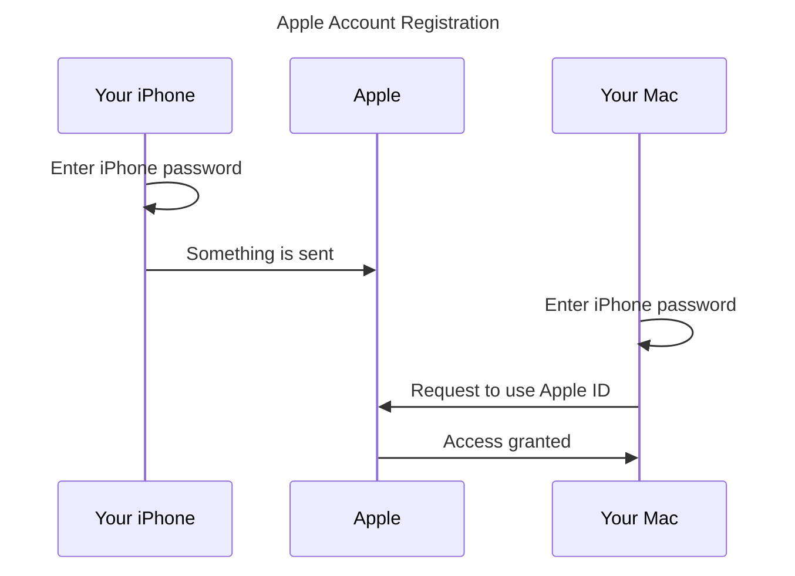

## Background

Apple has made recent updates to its two-factor authentication system. Important parts of this system are undocumented, and this systems make make your local system administrator password available to people at Apple and anybody with subpoena power or coercion over Apple. This also reduces the security of Apple’s File Vault 2 (full disk encryption).

All enrollees to the Apple developer program are required to use two-factor authentication for their Apple account.

## Steps to reproduce

As part of the process to enable two-factor authentication for iCloud, the Apple account holder is asked to enter their device password (iPhone Passcode or Mac Administrator Password). And the Mac Administrator password is the same password which is used to encrypt a Mac hard drive.

When this happens, the account holder is shown a prompt and it is explained that this password must be entered into another device to login to iCloud.

## Analysis

Here are the steps involved in registering multiple accounts with Apple.

Apple published [detailed documentation](https://support.apple.com/en-us/HT204915) for two-factor authentication, however this documentation wholly excludes any mention of the steps where you are required to enter your iPhone password or Mac administration password, which is ostensibly sent to Apple. Following is a screenshot of the current version of this webpage for posterity.

Zero explanation of this security feature is available so I cannot evaluate if the system is designed properly. I can imagine several possible poor implementations of the systems meeting all the advertised system features while also making my local hard drive encryption (File Vault 2) password at risk for Apple or an agent of Apple to brute force it.

By failing to describe the feature at the time that Apple software collects the account holder password and also failing to document it on the website, Apple fails to establish proper custody of this authentication token. If Apple wishes, or its agents, or anybody in any jurisdiction that has the authority of search warrants, the password could be misused. This would compromise the security of File Vault 2, a hitherto offline-only secure system.

## Summary

Anybody using File Vault 2 full disk encryption on an Apple computer where that computer's administrator uses two-factor authentication should consider their disk encryption broken. Their computer is no longer secure against physical interception and description.

## Disclosure timeline

- 2019-04-02: I made discovery, reported to Apple product security team, set 30-day disclosure timeline
- 2019-04-02: Apple sent automated email receipt
- 2019-04-04: Apple confirms investigation, requests additional details and extension to 30-day disclosure timeline
- 2019-04-04: I confirm no additional details are relevant, offer to extend disclosure timeline if defect is confirmed
- 2019-04-16: Apple confirms investigation, requests to see this full blog post
- 2019-04-17: I decline to send blog post, since the "substantive" part  was already sent and the blog post had not been written yet
- 2019-04-29: I sent a reminder that publication is forthcoming and will be delayed if the defect is confirmed
- 2019-05-05: Published to Privacy Log
