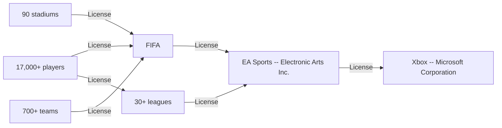
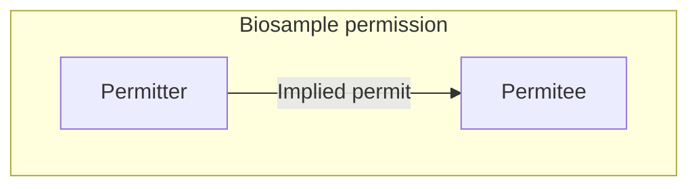

*A new model for tracking permissions using established blockchain standards, and an application for biosample data, is introduced.*

Written by: William Entriken, Daniel Uribe.

## The permission problem space

Permission is a broad problem space covering any *permit*, where a *permitter* will ultimately authorize some *property* use to a *permittee*. These permits cover a broad field of authorizations, which may also be  called “grants,” “consents,” “licenses,” and “clams.” A practical  example is the licensing deals in force to produce *FIFA 20*, a football video game [EA-1] [EA-2] [FIFA-1]:




In the classical example above, every permit shown is individually negotiated and signed between a permitter and permittee. These agreements are signed, bound under the laws of a specific jurisdiction and made between two legal entities.

This paper introduces a new business model where a permitee can  accept and use property from a permitter without directly having a  contract.



In this paper, we use the following terminology to define permission participants:

- **Biosample permission platform, “platform”** — a business intermediary to support permission participants
- **Property** — any intellectual or physical property interest, right or endorsement which can be granted
- **Permitter** — a legal entity which can authorize use of *property*
  - A A *permitter* must be able to create, activate and revoke *grants* using the *platform*.
  - B A *permitter* must be able to restrict derivative permits (i.e. sublicenses) of any of its *permits* using the *platform*.
- **Permitee** — a legal entity which desires to receive permission on *property*
  - C A *permitee* must confirm that any *permit* they receive is from a *permitter* that actually is authorized to make such a *permit*.
  - D The *permitee* identity must be public. This allows the *owner* to take action against any unauthorized use.
- **Permit** — a permission on a specific *property*, granted from an authorized *permiter* to a beneficiary *permitee*
  - E The public must see the current status

- - of any *permit*. This allows proper auditing.
- **Owner** — the legal entity for any given *property* which enjoys the exclusive original right to permit usage on it

We will introduce below a general system using established blockchain standards to support the classic business case above as well as a new  business model more focused on privacy.

## A basic biosample permission platform

We put forth a basic system for a permission platform to publish information and represent any permission relationship.

### Data inside the permission platform

This diagram below illustrates which data is required to keep inside this system:


This published permit information includes the status of whether the license is active or revoked (E).

### Permit references outside the platform

The identity of the permitee must be public (D), this is how the media owner and the permitee’s customers can verify the authenticity of any permit.

The permitee does this by simply using their existing well-known  publishing channel (press release, etc.) to make a statement that this  legal entity supports the permission platform and show their identifier.


### Owner references

In the same way that the public needs to verify the status of every  permit, the permitee needs to verify that any permit they are relying on is authorized. If you are buying the Brooklyn Bridge, make sure the  seller is the New York City Department of Transportation [NYCDOT-1]! The platform achieves this by:

1. Validating the owner identity & media authorization and indemnifying the permitee; and/or
2. The owner/donor of a biosample self-identifies pseudonymously directly at the time of sample collection

This allows the platform to provide assurance to a permitee that  permit they receive is from a permitter that actually is authorized to  make such a permit (C).

## Using non-fungible tokens to create and look up permits

To implement the basic permission platform above using a blockchain system, it is necessary to implement three features:

1. The platform will assign identities pseudonymously to owners and publicly to permitees using public-key cryptography.
2. The platform will assign property identifiers to owners after verifying ownership/authorization.
3. Anybody can become a permittor by creating any permit of any property to any permitee.

Because this is a blockchain system, all read-only operations are assumed to be free:

1. Anybody can find the pseudonymous identity of the owner of property.
2. Anybody can check the current status of any permit, recursively, back to the property owner.

There are several potential approaches to create a blockchain system  implementing these required features, we have chosen ERC-721  non-fungible tokens because this is a finalized standard [ERC-721] in  production use. We adopt the reference implementation of ERC-721,  including `ERC721Metadata` [0XCERT-1], use a special scheme for token identifiers and add two specialized functions.

### Token identifier layout

Every token represents a permit or an identity. And identities are  only valid if issued by the permission platform. On Ethereum Virtual  Machine blockchains, the word length (and token IDs) are 256 bits and  public keys are 160 bits [ETHEREUM-1]. Token identifiers (“IDs”) use a  special layout to reference all details needed for a license or  identity, shown below:

| Field                          | Length   |
| ------------------------------ | -------- |
| Permitter public key           | 160 bits |
| Property registered identifier | 48 bits  |
| Permitee registered identifier | 48 bits  |
| Total                          | 256 bits |

where registered identifiers are explained following.

### Convention on registering identity tokens

The platform will be responsible for identifying and authorizing all  owners and permittees on the system. The platform does this using a  convention.

The platform administrative blockchain account will be a well-known  public address (e.g. published on the platform’s website and published  with press releases). This administrative account will create identity  tokens in the following way:

- Permitter public key := the platform administrative blockchain account
- Property registered identifier := 0 *(this indicates no property)*
- Recipient (owner or permittee) registered identifier =: registered identifier *(id1, id2, id3, …)*

There can be no duplicate tokens in ERC-721 sharing the same token  ID. The platform administrative blockchain account will create this  identity token and transfer the token to the account that will control  that identity ID. Therefore the recipient should wait to confirm that  the platform recognizes them before using that account. After  transferring this token, it shall be impossible for the platform  administrative blockchain account to recreate or reassign that  registered identifier, and anybody shall be able to find the owner of  that registered identifier.


### Convention on registering property tokens

The platform will be responsible for registering property identifiers. The platform does this using a convention.

The platform administrative blockchain account will be a well-known  public address (e.g. published on the platform’s website and published  with press releases). This administrative account will create property  tokens in the following way:

- License public key = the platform administrative blockchain account
- Property registered identifier = registered identifier (m1, m2, m3, …)
- Licensor registered identifier = 0 (this indicates no licensor)

There can be no duplicate tokens in ERC-721 sharing the same token  ID. The platform administrative blockchain account will create this  media token and transfer the token to the account that is the owner for  that media identifier. Therefore the owner should wait to confirm that  the platform recognizes them before creating any permit with it.


### Specialized minting function

This minting function is an extension to ERC-721 which uses the token identifier layout above and allows anybody to mint tokens only when they are namespaced under that minter’s public key.

```solidity
/**
 * @dev Mints a new NFT.
 * @param _to The address that will own the minted NFT.
 * @param _permission Representation of the permission specification.
 */
function mint(
  uint256 _tokenId,
  string calldata _permission
)
  external
{
  require(address(_tokenId) == msg.sender, "TokenIds are namespaced to licensees");
  NFToken._mint(msg.sender, _tokenId);
  NFTokenMetadata._setTokenUri(_tokenId, _permission);
  emit URI(_permission, _tokenId);
}
```

### Specialized metadata function

Likewise, this metadata function is a similar extension to `ERC721Metadata` which allows anybody to set metadata for tokens they could mint (A, B).

```solidity
/**
 * @dev Set a permission for a given NFT ID.
 * @param _tokenId Id for which we want URI.
 * @param _uri String representing RFC 3986 URI.
 */
function setTokenUri(
  uint256 _tokenId,
  string calldata _uri
)
  external
{
  address tokenOwner = idToOwner[_tokenId];
  require(tokenOwner == msg.sender, NOT_OWNER);
  NFTokenMetadata._setTokenUri(_tokenId, _uri);
  emit URI(_uri, _tokenId); // This is a convenience event to help find permission changes
}
```

Metadata will be stored using a Uniform Resource Identifier for simple permits [] such as `data:active` and `data:revoked` to represent active and revoked license states. More complicated licenses can use Universe Resource Names or other links to persistent documents. Those documents could be encrypted as needed.

### Other relevant standardization efforts

Other projects have been started to study and standardize claims or  authorizations using an Ethereum Virtual Machine blockchain. These  include ERC-735 (DRAFT), ERC-780 (DRAFT), ERC-1812 (DRAFT) and possibly  more. One commercial product has published on using blockchain for  licensing intellectual property [BLMP-1].

## The role of permission platform, the role of blockchain

Of course, the classical permission business model is well known and  has been in practice for hundreds of years [MS-1]. By adding a  permission platform and blockchain, several distinct advantages are  derived.

The blockchain allows:

1. Owners have strict privacy guarantees — they provide zero personal information to anybody.
2. Owners and intermediary permitters can revoke any permit using the  public blockchain network, even without the cooperation of the  permission platform or permitees.

The permission platform allows:

1. Permitees can verify status of a permit across multiple jurisdictions and multiple intermediaries.
2. Owners can hope the permission platform will represent their interest in auditing permitees’ proper use of property.

## Application to biometric data and genomics

As a father, and a cybersecurity expert, Daniel wants to use this new amazing technology to make sure that his own son, when he becomes an  adult, has proof that Daniel used the best technology available to  protect his son’s privacy. Because this is about his DNA and the DNA of  the whole family. This is the opportunity to change the status quo to  change of who is in charge of the data and give people self-sovereignty  over their data.

Thanks to amazing advances in science, now we have $100 whole-genome  sequencing on the market. We also have a portable DNA sequencer for less than the cost of an iPhone. So we are literally on the brink of using  our DNA for multiple applications because it is now affordable. This  includes medical research, personalized nutrition, forensics (human  identification), personalized medicine, etc. The main issue is going to  be the proper and ethical management of this data. According to a KPMG  study, the main disincentive to participate in these studies is  currently privacy.

> 65% of individuals willing to use an at-home  [Direct-to-Consumer Genetic Test] service reported privacy as one of the main concerns; specifically, the potential sharing of data with third  parties including consumer health, pharmaceutical, and insurance  companies. Almost all of the respondents willing to use the service had  concerns about a company owning their DNA profile. [KPMG-1]

The world already has privacy laws like the General Data Protection  Regulation (GDPR) and California Consumer Privacy Act (CCPA), but it is  very difficult for biosample donors to exercise their rights or make a  claim using these regulations because there is lack of traceability and  proof when an entity misuses biosamples or data. This is an opportunity  for custodians of biosamples to provide proof to their customers that  they are handling samples only as expected. This will provide a  differentiator for companies that provide and traceability over other  companies that use broad-consent forms that “can be updated at any time” which customers do not trust.

With this new token, we are hoping to contribute to everybody that  places their trust into health care systems. Companies can become more  responsible and ethical where they manage human data and biosamples.  Let’s do our part to improve the system, so that donors can better trust health care and be more comfortable to participate in studies, so  researchers can have more access to data, which gives doctors more  access to life-saving innovations.


## Future research

Some items discussed in this paper are areas for future research:

1. Legal applicability of promissory estoppel or similar legal theory  to allow anonymous owners of property to make claims against permitees
2. Implementing the permission platform into a user-friendly product

## References

The permission problem space

- [EA-1] Electronic Arts, Inc. *EA & FIFA: Licensing Agreement Extended Until 2022*. May 8, 2013. <https://www.ea.com/games/fifa/news/ea-sports-and-fifa-extend-licensing-agreement-until-2022>. Accessed July 4, 2020.
- [EA-2] Electronic Arts, Inc. *FIFA 20 Exclusive Licenses: All Leagues and Clubs*. <https://www.ea.com/games/fifa/fifa-20/leagues-and-clubs-authenticity>. Accessed July 4, 2020.
- [FIFA-1] FIFA. FIFA Club World Cup: Regulations. December 15, 2018. <https://resources.fifa.com/image/upload/fifa-club-world-cup-2018-regulations.pdf?cloudid=tk5uj1eczwwsxas2zjsy>. Accessed July 4, 2020.

A basic biosample permission platform

- [NYCDOT-1] New York City Department of Transportation. *Infrastructure: Bridges*. <https://www1.nyc.gov/html/dot/html/infrastructure/bridges.shtml>. Accessed July 4, 2020.

Using non-fungible tokens to create and look up permits

- [ERC-721]. Entriken, William; Shirley, Dieter; Evans, Jacob; Sachs, Nastassia. *ERC-721 Non-Fungible Token Standard.* Ethereum Improvement Proposals, no 721, created January, 14, 2018. [Online serial]. <https://eips.ethereum.org/EIPS/eip-721>
- [0xcert-1] 0xcert. *ERC-721 Token: Reference Implementation*.  Updated June 29, 2020. <https://github.com/0xcert/ethereum-erc721>. Accessed July 4, 2020.
- [ETHEREUM-1] Wood, Gavin. Ethereum: *A Secure Decentralized Generalised Transaction Ledger: Petersburg Version*. June 8, 2020. <https://ethereum.github.io/yellowpaper/paper.pdf>. Accessed July 4, 2020.
- [EIP-735] Vogelsteller, Fabian. *ERC-735: Claim Holder [DRAFT]*. Ethereum Improvement Proposals, no 735, created October 9, 2018. [Online serial]. <https://github.com/ethereum/EIPs/issues/735>. Accessed July 4, 2020.
- [EIP-780] Torstensson, Joel. *ERC-780: Ethereum Claims Registry [DRAFT]*. Ethereum Improvement Proposals, no 780, created November 29, 2017. [Online serial]. <https://github.com/ethereum/EIPs/issues/780>. Accessed July 4, 2020.
- [EIP-1812] Braendgaard, Pelle. *ERC-1812: Ethereum Verifiable Claims [DRAFT]*. Ethereum Improvement Proposals, no 1812, created March 3, 2019. [Online serial]. <https://eips.ethereum.org/EIPS/eip-1812>. Accessed July 4, 2020.
- [BLMP-1] Blockchain Licensing Marketplace. *What is BLMP?*. Feb 28, 2018. <https://medium.com/@BLMPNetwork/what-is-blmp-471df7e44b23>. Accessed July 4, 2020.

The role of permission platform, the role of blockchain

- [SEID-1] Seid, Michael H. Where it All Began: *The Evolution of Franchising*. <https://www.franchise-chat.com/resources/where_it_all_began_the_evolution_of_franchising.htm>. Accessed July 4, 2020.

Application to biometric data and genomics

- [KPMG-1] Friend, Lauren; O’Neill, Jessica; Rivlin, Adrienne; Browne, Robert. *Direct-to-consumer genetic testing: Opportunities and risks in a rapidly evolving market*. 2018. <https://assets.kpmg/content/dam/kpmg/xx/pdf/2018/08/direct-to-consumer-genetic-testing.pdf>. Accessed July 10, 2020.
