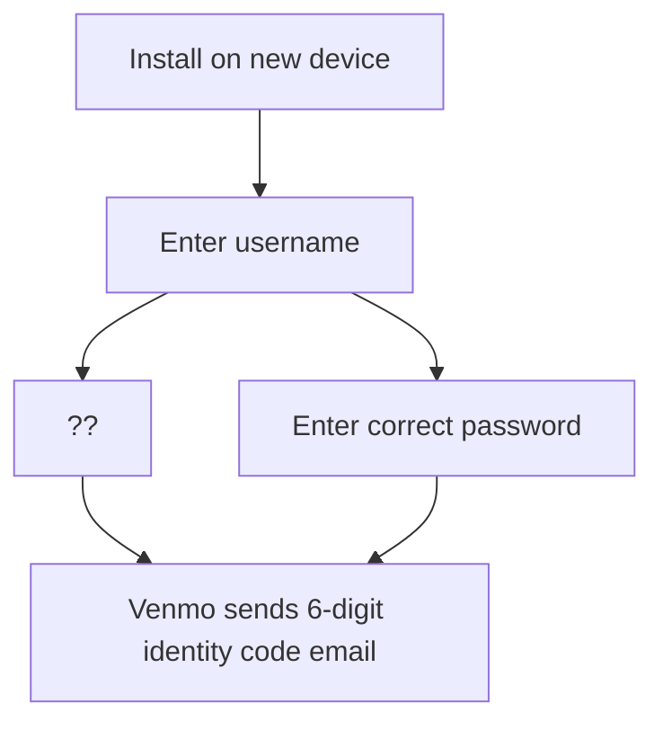

*This article is being written based on evidence I reviewed from [Russell Thomas](https://x.com/RunGoodRussell) and similar anecdotes he has heard as a pattern among professional poker players. I cannot confirm this is a trend, so I’m putting it out there and hoping you can share your experiences. If it’s a trend let’s make it expensive for Venmo to ignore!*

## What do you see first?

First you see a login identity code that you did not request. I’m not exactly sure yet if this indicates the attacker actually has your password. But I hear this attack is being used against passwords that have not been reused on other websites. (The most common source of password theft is trying known passwords on new sites.)

This email is also weird because it indicates that Venmo does not have the customer’s phone number

> Update your phone number on Venmo after you are signed is so that you can automatically receive these codes via text message in the future.

As you will soon see Venmo actually does have the correct phone number on file and knows it can send text messages to it.

⚠️ If you see this above email when not expected, act fast you have about 5 minutes to prevent losing all the money in your account.

## The precursor

Here is where you know the damage is coming quickly…

## And it’s gone

Here are the email notifications you are NOT getting because at this point your emails are not coming to you. (These are visible later, if you can get access back to your account.)

The attack proceeds as first a small test transaction. Then several transactions proceed. I am assuming that $2,999 is a special number chosen to be just below some $3,000 limit. (This probably represents “structuring” which is a crime under US Federal jurisdiction, 31 U.S. Code § 5324.) Finally, another small transaction is made to get the total balance to a targeted amount.

It is not useful for me to say what the account balance was or the small  amounts, so this is redacted. But I can tell you that the total amount  taken was clearly chosen as a way to be less than $10,000. This is a  special number in the United States, because transferring that amount of money triggers the required reporting of a [currency transaction report](https://en.wikipedia.org/wiki/Currency_transaction_report) with FinCEN.

All of the five transactions were carried out during the 3:25 PM and 3:26 PM minutes. (Venmo does not provide resolution to the seconds.) This indicates transactions took between 0 and 120 seconds, not inclusive. It is feasible for a human using Venmo to make five transactions in 120 seconds. If Venmo had provided seconds resolution, and if the time was a lot closer to 0 seconds or the times were evenly spaced then we might have suspected an automated script.

## Risk management

All transactions were an “instant transfer” Venmo transaction type to a Visa Debit card.

Below are details about what authority and regulations apply to this money transfer. Surprisingly, if you have ever been scammed, there is usually a key word in documents like this that explain how you can make recovery or how you can positively assign blame in a way that someone else is undeniably responsible for reimbursing you.

Venmo defines [what is an instant transfer](https://help.venmo.com/hc/en-us/articles/115015844068-Instant-Transfers-FAQ).

Venmo commits to review these transaction and [spells out their review process](https://help.venmo.com/hc/en-us/articles/115015446688-Reviews-of-Transfers-Out-of-Venmo).

Venmo's license to transfer money is through PayPal as noted in their [terms of service, in footer](https://venmo.com/legal/terms/us-licenses/) (don’t follow that link, use the one below).

PayPal publishes its up-to-date [money transmitter licenses per state](https://www.paypal.com/us/webapps/mpp/licenses).

Here is [PayPal's license for Nevada](https://www.paypalobjects.com/marketing/web/us/en/licenses/NV-2020-License.pdf).

The regulatory authority that services that license is [Nevada Department of Business and Industry, Financial Institutions Division](https://www.fid.nv.gov/).

I don’t have any further legal analysis here, but I’m guessing that PayPal by allowing transfers that aren’t manually reviewed by their staff, and which happen instantly, they are likely responsible for reimbursing the victim in the case of fraud. (Because otherwise money transmitters would make every payment instant every time.) Check your state laws and regulations for details to study more.

## Next steps

Send an email to [security-alerts@venmo.com](mailto:security-alerts@venmo.com) stating:

> That was not me. Please freeze my account.

This should result in an automatic response and freezing your account. 👍 this part looks like it is working well. I understand that humans will also then follow up with you in <24 hours to regain access to your account.

I have reviewed a customer support chat log for the above incident and can see that Venmo was responsive, had escalated the issue, set a timeframe for responding (7–10 business days), and was apologetic. The conversation was not very deep, so I cannot definitively comment on whether the support agent was a robot. If it was, it passes the Turing test for probably 90%+ of support cases.

If you are somebody that has had an infuriating experience with PayPal before, you might not trust them further than you can throw them. Here are specific things you could do to seek recourse:

- Lodge a complaint with the department/office that granted PayPal a money transmitter license in your state, cite anything you see that was a problem, as well as their failure to immediately return your money.
- File a local police report and request a search warrant against Venmo for every record they have about your account (IP addresses, login times, transaction details), against Visa for any records relating to the debit card in question.
- File a Right to Know request (like a Freedom of Information Act) against your state’s office that provided PayPal’s money transmitter license, request a list of all complaints against PayPal.
- File a lawsuit against PayPal/Venmo in your local small claims court seeking full recovery on account of their failure to take reasonable measures to safeguard your money.

## Recommendations for Venmo

Following are recommendations to improve Venmo. Or in other words, documentation of their failure to execute reasonable security best practices.

1. The “Venmo Security Code” email should not have been sent in the first place. Venmo clearly has an account phone number on file (see later text message), so requesting the phone number doesn’t make sense.
2. When attempting to login, the out-of-band notification (the email, or the text message) should tell you the IP address and device that is attempting to login.
3. For financial transactions, a 6-digit code is insufficient. 8 digits or more are needed. (Unfortunately, NIST may be promoting an insecure conflicting note in their [800-series recommendation](https://nvlpubs.nist.gov/nistpubs/SpecialPublications/NIST.SP.800-63b.pdf)).
4. Adding a new payment output type (the new debit card) should trigger an email (we are not sure if this happened) and a multiple-day delay before payment can go to the new method.
5. Adding a new payment output type where Visa cannot confirm that the name on the account matches the name on the Venmo account should flag the account for manual review and halt all transfers.
6. Sending two transfers within the same day for an amount greater than $1,000 and having the tens and hundreds place digit of 9 should trigger an automated review of the account for possible fraud.
7. Sending multiple transfers within the same day to the same place with an aggregate amount between $9,800 and $10,000 should trigger an automated review of the account for possible fraud.
8. Changing the email address should prevent money transfers out of the account for a certain number of days. And it should notify the old email address with the option to cancel the transfer.
9. An account with elevated risk of fraud (see “automated reviews” above) should not be eligible for instant transfers for a certain cooldown period of time.

## Timeline

- 15:13 Received login security code by email
- 15:21 Received email changed notification by email
- 15:24 Received text to reset password
- 15:35 (Found out later) this is when first outbound transfer executed
- 15:35 Victim sent an email to [security-alerts@venmo.com](mailto:security-alerts@venmo.com) (by chance, at the same time as the transactions)
- 15:36 (Found out later) this is when last outbound transfer executed
- Soon after: customer support email and chat

This story is developing and the resolution has not been attained.

## Closing notes

A few more questions here are, how did they get into the account in the first place? It [is well-documented already](https://www.nist.gov/blogs/cybersecurity-insights/questionsand-buzz-surrounding-draft-nist-special-publication-800-63-3) that SMS messages can be stolen in-transit for the purposes of breaking into accounts. This surely contributed.

I do not see if the password was guessed or otherwise compromised from within Venmo. Or possibly there is some other authentication workflow to get into the account. I think businesses should document exactly under what circumstances an account can be logged into, with a diagram, and linked from the login page. But that trend has yet to start.

Also, why poker players? Well poker players are a good target as people that might have cash sitting in a Venmo account. I cannot be sure if this scam is targeted to poker players specifically on a certain site or if there is confirmation bias. But either way, I’m putting it out there so please share your experiences too.
