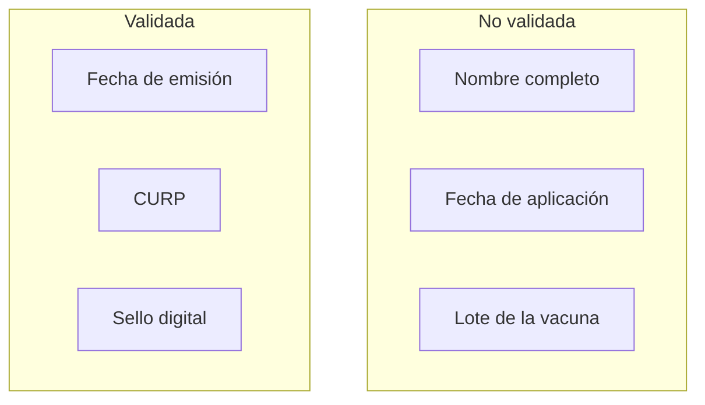

## What is the the certificate?

The federal government of Mexico, department of health rolled out a nation-wide COVID-19 vaccination certificate program where local laboratories can record vaccinations in the central database with digital certificates that anybody can validate on the government website using a simple QR code.

Unfortunately, these were not implemented correctly and all these certificates are susceptible to forgery nationwide.

## How to break it?

⚠️ Warning, this is a live exploit which is shown for demonstration purposes only. Do NOT use this technique to forge a COVID-19 vaccine certificate and present it as a real certificate. That may be a crime under Mexican law and/or rules in other jurisdictions. In addition to the crime, you may be putting fellow humans at risk of disease transmission!

Below a video is shown where a legitimate government COVID-19 vaccination certificate is manipulated to claim vaccination for Cri-cri, a popular Mexican cartoon character. Then this certificate is scanned and the government website claims it is authentic.

The word DEMO is added to the certificate to indicate this is not a genuine certificate. However, removing the word DEMO would make this indistinguishable from a real certificate.

And here is the validation video.

<iframe height="266" src="https://www.youtube.com/embed/c-PpWbuRFCA" width="320"></iframe>

## Why is this vulnerable?

This system is vulnerable to forgery attacks because the information which is validated is less than the full information which is on the certificate. Any information which is not validated is vulnerable.

eee

There is a separate vulnerability of a different class. All the information necessary to create this system is held on the central federal government server. From a technical perspective, this data sharing is unnecessary, but there may be regulatory reasons that this approach is desirable.

## Recommendation

Blockchain certificates is another technology for certifying COVID-19 test results. This solution fully certifies every fact on the certificate under the authority of the issuing laboratory/clinic. And it works without any central database having any access to patient data.

This solution is already endorsed in Mexico by the state of Quintana Roo, is in production use across the country. And it uses blockchain time stamping to prevent internal and external fraud/forgery.

## Disclosure timeline

It is very likely other people have found this simple exploit already and are actively using it to produce fake certificates. Because of this, this report is being released public with no embargo and is simultaneously being sent to the Mexican Department of Health.

- 2021-07-19 Initial public disclosure
- 2021-07-19 Announce to Mexican Department of Health

---

## ¿Qué es el certificado?

El departamento de salud del gobierno federal de México implementó un programa de certificado de vacunación COVID-19 a nivel nacional donde los laboratorios locales pueden registrar las vacunas en la base de datos central con certificados digitales que cualquiera puede validar en el sitio web del gobierno usando un simple código QR.

Desafortunadamente, estos no se implementaron correctamente y todos estos certificados son susceptibles de falsificación en todo el país.

## ¿Cómo romperlo?

⚠️ Advertencia, este es un exploit en vivo que se muestra solo con fines de demostración. NO use esta técnica para falsificar un certificado de vacuna COVID-19 y presentarlo como un certificado real. Eso puede ser un delito según las leyes mexicanas y / o las normas de otras jurisdicciones. Además del delito, ¡puede poner a otros seres humanos en riesgo de transmisión de enfermedades!

A continuación, se muestra un video en el que se manipula un certificado de vacunación COVID-19 legítimo del gobierno para reclamar la vacunación de Cri-cri, un popular personaje de dibujos animados mexicano. Luego, este certificado se escanea y el sitio web del gobierno afirma que es auténtico.

La palabra DEMO se agrega al certificado para indicar que este no es un certificado genuino. Sin embargo, eliminar la palabra DEMO haría que esto no se pudiera distinguir de un certificado real.

Aquí está el video de validación.

<iframe height="266" src="https://www.youtube.com/embed/c-PpWbuRFCA" width="320"></iframe>

## ¿Por qué es esto vulnerable?

Este sistema es vulnerable a ataques de falsificación porque la información que se valida es menor que la información completa que se encuentra en el certificado. Cualquier información que no esté validada es vulnerable.

Existe una vulnerabilidad separada de una clase diferente. Toda la información necesaria para crear este sistema se almacena en el servidor del gobierno federal central. Desde una perspectiva técnica, este intercambio de datos es innecesario, pero puede haber razones reglamentarias por las que este enfoque sea deseable.

## Recomendación

Los certificados blockchain son otra tecnología para certificar los resultados de las pruebas COVID-19. Esta solución certifica completamente todos los hechos en el certificado bajo la autoridad del laboratorio / clínica emisor. Y funciona sin ninguna base de datos central que tenga acceso a los datos del paciente.

Esta solución ya está avalada en México por el estado de Quintana Roo, se encuentra en uso productivo en todo el país. Y utiliza el sello de tiempo de la cadena de bloques para evitar fraudes / falsificaciones internos y externos.

## Cronograma de divulgación

Es muy probable que otras personas ya hayan encontrado este simple exploit y lo estén utilizando activamente para producir certificados falsos. Por ello, este informe se hace público sin embargo y simultáneamente se envía al Departamento de Salud de México.

- 2021-07-19 Divulgación pública inicial
- 2021-07-19 Anuncio al Departamento de Salud de México
