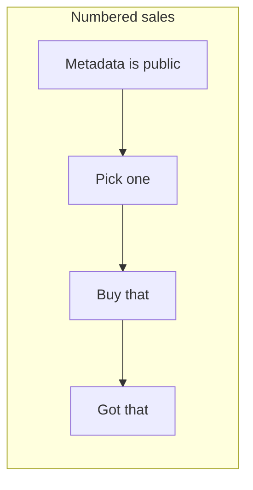
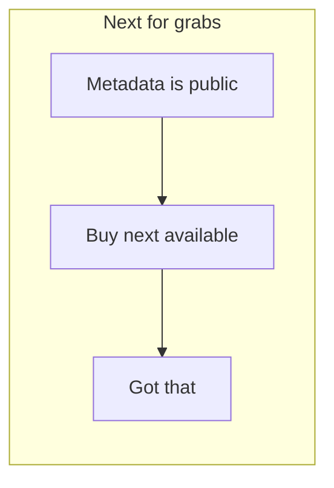
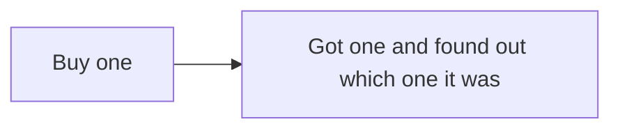
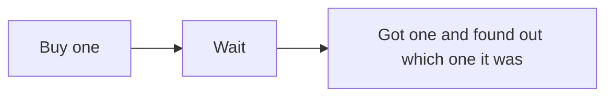
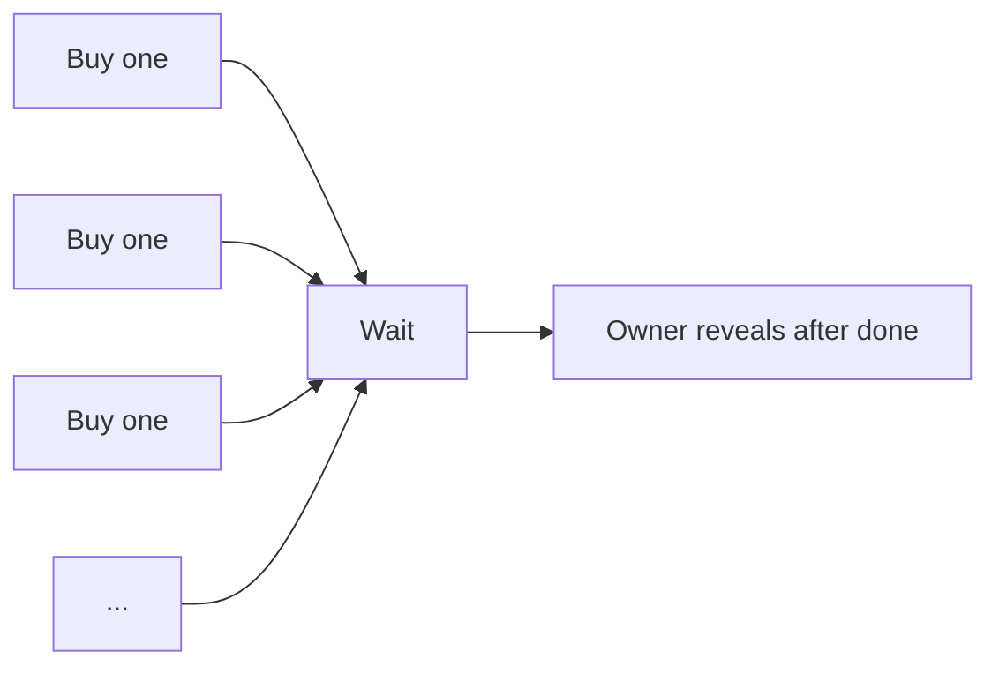

*ℹ️ This article assumes a basic/intermediate understanding of game theory, blockchain transaction settlement, entropy (mathematics) and Solidity. However the conclusions and reasoning are usable to anybody evaluating risks with different NFT drop approaches.*

NFTs that are released for sale typically drop as a set, and each asset in the set has a different value or may appeal differently to different people. Even with [500 still frames of Joe Biden eating a sandwich](https://xkcd.com/915/), some are great and some are terrible.

This article reviews different approaches to randomization I have seen in the wild or heard about. 

Of course product designers will ask for the holy grail, but... <mark>Fair, random and immediate sales are not possible on decentralized ledgers. ("No FRID".)</mark> Many creative solutions have been tried to trade between these features.


Below are summaries and examples of randomization strategies. Please note that the summary describes a best possible implementation of the randomization strategy and does not represent [a William Entriken audit](https://phor.net/advisory) of each mentioned contract.

## Base concepts

It's dangerous to go alone, take these concepts. 🗡

<dfn>Naive</dfn> describes a party using the most popular software and following all the directions properly.

<dfn>Malicious</dfn> describes a party that is doing something other than the most naive thing and which would give others a worse outcome than if they did the most naive thing.

{: .margin-note}

As of 2022-02-07, 85% of miners on Ethereum Mainnet participate in MEV.

<dfn>Miner Extractable Value (MEV)</dfn> is where people that process your blockchain transactions will front-run, censor or sandwich your transaction to profit at your expense.

<dfn>Advanced MEV</dfn> are techniques that can be implemented with MEV but are not currently seen in the wild. This includes controlling the `BLOCKHASH`. I am developing these techniques and they will be more popular starting in 2023.

Pricing the assets (uniform price, individual prices, blind auctions, time-based auctions, pooled auctions, bonding curves, quantity discounts, friend discounts and other price discovery) is an important consideration. Pricing system design is not part of this article and systems/bidding can be NP-hard.

## No randomization



Here all the NFTs are available for sale and buyers can come get whichever ones they want. Buyers know exactly what they are getting (e.g. metadata is public).

{: .table}

| Fair  | Random | Immediate |
| ----- | ------ | --------- |
| ✅ Yes | ❌ Not at all  | ✅ Yes |

Each purchasing transaction is a signal expressing value for a specific asset over all other available assets (possibly even with next-for-grabs). That signal could be front-runned using MEV. And these MEV participants could even outbid each other. The threat is so abstract that I am still rating this as "fair". Also, this could be addressed by using different princing mechanisms.

Examples:

{: .margin-note}

Some people dispute whether Terra Nullius is an NFT.

* [Su Squares](https://tenthousandsu.com) ([smart contract](https://etherscan.io/address/0xE9e3F9cfc1A64DFca53614a0182CFAD56c10624F)) is a numbered sale where the location (x-y grid) is public ahead of time and graphics metadata is added by token holders.
* [CryptoPunks](https://www.larvalabs.com/cryptopunks) ([smart contract](https://etherscan.io/tx/0x0885b9e5184f497595e1ae2652d63dbdb2785de2e498af837d672f5765f28430)) is a numbered sale where the images [were published](https://github.com/larvalabs/cryptopunks/blob/master/punks.png) before the contract went live.

## Next-for-grabs



Here all the NFTs metadata is public. Each buyer has only the choice of buying the next available one. Because multiple parties can participate on the blockchain simultaneously, it is possible that a buyer things they are getting one thing but when the transaction settles they got a different thing.

{: .table}

| Fair      | Random       | Immediate |
| --------- | ------------ | --------- |
| ✅ Yesish† | ❌ Not at all | ✅ Yesish‡ |

† If somebody is purchasing something, an MEV participant could jump in line to get that one.

‡ It is possible that the next available item will be objectively undesirable. In this situation, the Nash equilibrium is that nobody buys your product—they are all waiting for someone else to take one for the team.

Both of these can be addressed by using a pricing mechanisms, such as by using a time-based auction.

Examples:

{: .margin-note}

Some people dispute whether Terra Nullius is an NFT.

* [Terra Nullius](https://fulldecent.blogspot.com/2021/09/there-are-no-nft-contracts-before-terra.html) ([smart contract](https://etherscan.io/address/0x6e38a457c722c6011b2dfa06d49240e797844d66)) is a next-for-grabs giveaway.

## Immediate reveal



A customer places an order and receives one of the remaining available tokens, selected immediately using `BLOCKHASH` from the previously-settled block.

{: .table}

| Fair  | Random | Immediate |
| ----- | ------ | --------- |
| ❌ No | ❌ Noish | ✅ Yes     |

When a naive person submits a transaction, they do not know which block it will settle after. So for them the outcome is unexpected. But in 2022 with widely-available MEV, you must assume somebody using your contract can know (or maybe even set) the `BLOCKHASH` from the previously settled block.

Because some people have this advantage and the naive person will not, the immediate reveal is not fair. And because those people with the advantage can choose (or influence the choice of) their tokens, this is not so random.

You can reduce/minimize the advantage using the Entriken-Fisher-Yates multiplayer shuffling algorithm:

{: .margin-note}

Unbiasing the input entropy can be optimized out for a `BLOCKHASH`/shuffling application. But unbiasing the output *is* necessary if the inventory of NFTs has patterns (e.g. the first ones are better or have lower `tokenID`s).

{: .margin-note}

This algorithm can be made more granular by inputting perplexity rather than specifying entropy in bits. Call me if you found an application where that matters.

```solidity
// Cryptographic primitives ////////////////////////////////////////////////////

/// @notice Normalize an entropic value over the full word size
/// @param  input a source of entropy
/// @return normalized value across the range [0, 2^256)
function _unbiasEntropy(uint256 input) internal returns (uint256) {
    return uint256(keccak256(abi.encode(input)));
}

/// @notice Mixes new entropy into `_entropyState`
/// @param  additionalEntropy a source of entropy to use
/// @param  howManyBitsToMix  how much influence the `additionalEntropy` has
function _mixEntropy(uint256 additionalEntropy, uint8 howManyBitsToMix) internal {
    uint256 clippedAdditionalEntropy = _unbiasEntropy(additionalEntropy) % (1 << howManyBitsToMix);    
    _entropyState = _unbiasEntropy(_entropyState ^ clippedAdditionalEntropy);
}

// Shuffling ///////////////////////////////////////////////////////////////////
uint256 private _entropyState = uint256(blockhash(block.number - 1));
CustomArrayType private _inventory;

function _takeFromInventory() internal returns (uint256 retval) {
    require(_inventory.length > 0, "Inventory underflow");
    return _inventory.popAtIndex(_entropyState % _inventory.length);
}
```

Here is the tradeoff:

{: .table}

| Participant | Participant contributes zero entropy | Sweet spot? (N bits)          | Participant contributes 256 bits of entropy |
| ----------- | ------------------------------------ | ----------------------------- | ------------------------------------------- |
| Naive buyer | Same as next-for-grabs               | Random, gets one of 2^N items | Random, gets ANY item                       |
| MEV buyer   | Same as next-for-grabs               | Can pick one of 2^N items     | Can pick ANY item                           |

You can see there is a basic axiom here. <mark>The amount of randomness in an immediate random sale is directly equal to how much advantage an MEV buyer has over a naive buyer.</mark>

So how does a naive buyer upgrade to a MEV buyer? A buyer can rely on **rerolls** (available today) or **hash management** (advanced MEV). A reroll means that if a transaction was about to be settled and the transaction would result in an unfavorable token selection, then that transaction is bounced and it is not settled. Under proof-of-work, the cost of selecting a desirable blockhash increases exponentially with the proportion of undesirable `BLOCKHASH` you wish to exclude. Under proof-of-stake the cost of hacking `BLOCKHASH` is still exponential but the coefficient is about 1000× lower.

Examples:

- [Meebits drop was hacked for millions](https://cointelegraph.com/news/85-million-meebits-nft-project-exploited-attacker-nabs-700-000-collectible) because it allowed buyers to know which ID they were getting while also accidentally revealing which IDs were valuable. The attacker used the "rerolls" technique.
- [The Photon Project](https://thephotonprojectnft.com) ([smart contract](https://etherscan.io/address/0x0E30a504ED0497Aaf18C30bdf2Fe6a9046eCb85F#code)) uses a simple immediate reveal (`_getRandomNumber`) that any MEV participant could game.

## Iterative commit-reveal



A commit-reveal mechanism is used so that anybody can purchase a token, but they won't know what they got until later when it is revealed.

{: .table}

| Fair             | Random           | Immediate |
| ---------------- | ---------------- | --------- |
| 🤷‍♀️ Maybe in 2022 | 🤷‍♀️ Maybe in 2022 | ❌ No      |

Reveals can happen with agency from that buyer, from a subsequent buyer, and/or from an administrator of the contract.

And the timing of the reveal can be "soon" (influenceable by that buyer), "at end" (when the entire drop is complete) or "at checkpoint" which is some point before the entire drop is complete.

There are several ways to get this entropy:

1. A specific future `BLOCKHASH` or other source of entropy on-chain
2. An offchain oracle

{: .margin-note}

I'll open a separate discussion on offchain oracles later.

Let's clarify about an offchain oracle, first that is not a decentralized system and second it is not random. Many people have a thought otherwise, but do not have a strong conviction/evidence. 

There are ways for an MEV participant to manipulate the `BLOCKHASH`. But these techniques are not well-known in 2022. I'm working to change that. <mark>Hacking NFT drops will get a lot easier in 2023 due to proof-of-stake.</mark>

Examples:

* [Area](https://area.world) ([smart contract](https://etherscan.io/address/0xf85c6320cc60DEC45Af1f7cE82B13dd24D539690#code)) uses a "commit train" so that each buyer is doing a commit as well as the reveal for the previous buyer.
* [Non-Fungible Fungi](https://twitter.com/FungibleFungi) ([smart contract](https://etherscan.io/address/0x90ee3cf59fcde2fe11838b9075ea4681462362f1#code)) uses an VRF oracle to pick token indicies.

## Metadata reveal at end



In this scenario, nobody knows which items they got until the drop is complete and then the owner reveals to everybody.

{: .table}

| Fair | Random       | Immediate |
| ---- | ------------ | --------- |
| ❌ No | ❓ You decide | ❌ No      |

There are a couple scenarios where this can go horribly wrong.

1. The owner could be hit by a bus or rug pull, then nobody receives their assets that they purchased.
2. The owner could have a choice of which metadata to reveal, giving the best ones to their friends (this can be fixed by committing the metadata before sale).
3. The owner could tell their friends which metadata are good and which are bad, their friends get the good ones, everyone else gets what's left.
4. The metadata could be accidentally released, so people that find it are like "friends" above.

There are a few mitigations to make this not so terrible.

1. The owner could use staking to disincentivise themselves from rug pulling or getting hit by a bus.
2. The reveal could be set for a specific time and the randomization could be picked in a way that uses entropy from several `BLOCKHASH`s. If done correctly, this limits the impact of manipulating any `BLOCKHASH`.
3. Post the list of possible metadata upfront. If you know it and you are hiding it and you can buy anonymously this is a huge red flag.

Examples:

- [Meebits accidentally revealed which metadata was good](https://cointelegraph.com/news/85-million-meebits-nft-project-exploited-attacker-nabs-700-000-collectible) by publishing the data on IPFS and making it available on their website
  - [Peter Kacherginsky has](https://iphelix.medium.com/meebit-nft-exploit-analysis-c9417b804f89) a good analysis of the hack

## Reading circle questions

- What is the difference in risk profile from a founder that publishes the metadata before a drop starts versus after it ends?
- Will it be random if the founder promises to use next week's Dow Jones Industrial Average opening price as a seed for random distribution?
- Is the risk of rug pulls/disappearance moot when you buy in a presale?
- How do auctions and other price-discovery mechanisms offset the "abstract" risk discussed under "no randomization" above?
- Is there any benefit to using an auction for drops which are designed to be "random"?

You are welcome to discuss these at your reading club, or also raise them during [NFT/Web3 Community Service Hour](https://phor.net/#speaking).
