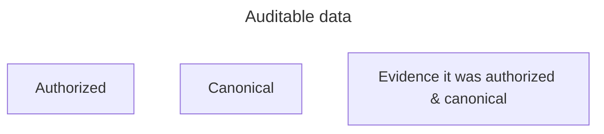
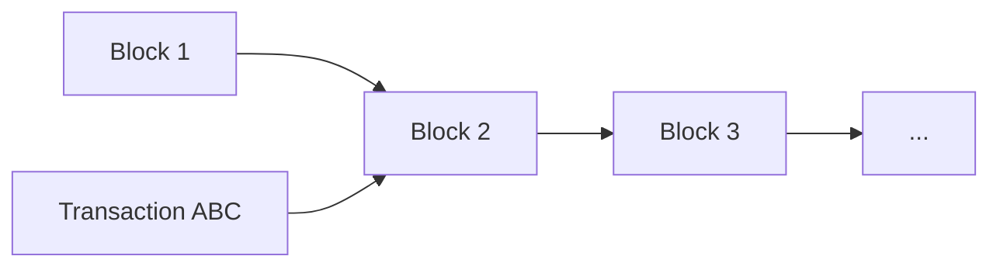
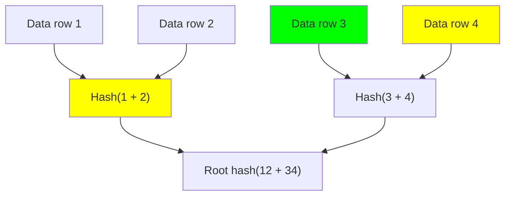

Blockchain people have been to "the moon" and back down to Earth. We brought back moon dust.

With inspiration from Bitcoin—a battle-tested, scam-tested, everybody-pseudonymous, trillion dollar network—there are lots of concepts and techniques we can apply to business databases and real life.

This articles shows you some of these concepts, exactly how to apply them and the new business opportunities, all using your existing enterprise databases. This is the Web 2.5.

## What is auditable data?

Auditable data is **authorized** and **canonical** with **evidence** it was authorized and canonical.



<mark>We're talking about evidence beyond a reasonable doubt, irrefutable.</mark>

**Authorized**

{: .margin-note}
This article is way more fun if you stop at the questions and think!

If your bank sends you an account statement on their letterhead... is that irrefutable evidence you can use in court?

No. Because Photoshop. Add zeros to the end of the balance, and it looks just as authentic as the original.

In the real world we rely on pieces of paper with logos on them because there is a standing threat of civil or criminal prosecution if an unauthorized party will forge documents we depend on. This is not irrefutable, but it might be useful for many situations, especially if you are in the social class of people that can make government and companies go after people that hurt you.

{: .margin-note}
If digital signatures could be forged, somebody would likely use that to steal billions or trillions of US dollars worth of blockchain assets. Eventually it would be front-page news everywhere.

On blockchains, attestations are made using cryptographic signatures. Strong cryptographic signatures are irrefutable. Reputations of the entity doing the signing are critical—whether that is because they are the owner of something they are sending you, or for other reasons.

**Canonical**

{: .margin-note}
See also: [selection bias](https://en.wikipedia.org/wiki/Selection_bias)

Quick story, "the lucky bettor?". A potential business partner showed me a six-way parlay sports bet that he won. And he explained that he makes one bet each week, trying to convince me he has a profitable betting system. (Winning a six-way parlay is rare.) On the bet ticket I can see that his wager was one dollar. Is this irrefutable evidence that he has a winning betting system?

{: .margin-note}
The trick also works for financial advisors: call 200 rich people (Manhattan phonebook) and leave a voicemail randomly predicting if the market will go up or down this week. Next week repeat only for people you left a correct prediction. After 7 weeks, there's only one person left. But they might want to do big business with you.

No. Because everybody I know has at least 100 dollars. Without a betting system, anybody can make 100 random six-way parlay bets and very, very likely win one of them. They can take that winner and show it to me. Since a profitable sports betting system is difficult to make and the evidence I saw was consistent with anybody who has 100 dollars, I did not find this as strong evidence supporting his claim.

But. What if that person logged into his account and showed me that he only makes one six-legged bet each week on that account. And he wins many of them. And I know that creating many betting accounts is difficult. Well now the evidence is getting better. This demonstrates that the bet he is showing me is his *canonical* bet. **It is the exclusion of other bets that makes this notable.**

"Skin in the game" is canonical, because it is relative to your resources. If a person represents that they donated X to charity Y and cites this as their commitment to a specific cause or belief then an important question a skeptic can ask is: what percentage is X of your net worth? **It is the commitment of *relatively substantial* resources that makes skin in the game notable.**

## Blockchain databases

Blockchain systems publish auditable data very effectively. They do it every day, continuously. Let's break down how it works.

You've probably seen this picture before, even if you don't care or know how it works:



The basic idea of blockchain is that it is an ongoing progression of records. A database, a ledger. And it is effective because when something is published on there it stays on there. You can be confident that something you publish on a (well-known) blockchain which is (subjectively) finalized will be visible to anybody else that cares to see it.

The way it does this is by deploying vast resources, skin in the game. For Bitcoin (as of today), each block represents about USD 200,000 worth of coal burned and depreciation of capital resources (i.e. computers)... every 10 minutes.

On Ethereum (as of today) this is also done by staking vast resources. But in this case, the resources are about USD 60,000 worth of Ether, used and recycled every 12 seconds.

In either case, the commitment to you is that your data will be stored in a *canonical* place, and other people can find it. And if there is any flimflam going on then somebody will be wasting hundreds or thousands of dollars every second while other people are working to republish and secure your published data.

Each record is also cryptographically signed.

These mechanics are pretty broad and support many applications on blockchains. But also these concepts work really well for business applications as well.

## Auditing your business data

Financial accounting best practices (e.g. Sarbanes-Oxley Act section 404, Public Company Accounting Oversight Board accounting standard #5) require that systems which record financial records will record transactions and even reversals/modifications of those transactions.

This necessitates that accountants will not have administrative ("super user", "root", "sysadmin") privileges over the systems they are using.

This setup means a company will need *two* people (one in IT and one in accounting) if they want to alter their records to deceive tax collectors, auditors or their own management.

It's a step in the right direction but we can do better to achieve assurance.

We can have companies to quarterly send a copy of all financial records and internal system files to regulators or auditors. And then auditors will only review those files if needed for an audit.

If this organization we are considering is a government entity which is committed to transparency this should be the default option. (They should go further by [publishing all records](https://www.fpds.gov/fpdsng_cms/index.php/en) when generated, rather than quarterly or only to auditors.)

But for organizations that do not want to send all records to government all the time, we can achieve the same assurance by making a cryptographic [hash](https://en.wikipedia.org/wiki/Hash_function) of the records and sending that. Modern hashes (e.g. SHA-256) are irrefutable.

Here is an example manifest of some files:

```
b0a4e7180f8cc4a7a235c46e52d949823e78fc0d3278f61dc89254696309ced0  2023Q1-balance-sheet-valuation-support.db
611edec1292d14dce02ff89acbbdf30e6faf6f9de080053fc9bc8dca7f5b473e  2023Q1-customer-account-balances.db
739abcd02c7cccab8d1465dc7ff675c95c759cbb608d4a9a71bd374555718cef  2023Q1-raw-accounting-transactions.db
```

*On macOS terminal use `shasum256 *` or Linux/Windows WSL use `sha256sum *` to try this with your own files.*

The idea is that if you provide enough granularity than an auditor may only request you to turn over some of your data (possibly back-and-forth in multiple rounds) and therefore you avoid sending data  that is unnecessary.

This up-front attestation of batches of records is a reasonable ask for governments and auditors to make of companies. Why? Because when a government comes in the future to ask a company for its records (which is within its prerogative) it is expecting to receive those exact records which existed at that time--not some post-facto adulteration of those records.

This approach of sending/publishing a hash of a file and then later sending/publishing that file is called commit-reveal.

All of these are commercial best practices, used to various degree in industry.

## Auditable business data, a SQL example

Here is a simple example of a SQL database (SQLite) which implements an auditable trail for all changes to the database.

Access this project at https://github.com/fulldecent/versioned_database_template

```sql
CREATE TABLE favorite_words (
  word TEXT
);

CREATE TABLE audit (
  timestamp DATETIME DEFAULT CURRENT_TIMESTAMP,
  changed_table TEXT,
  changed_rowid INTEGER,
  changed_column JSON TEXT
);

CREATE TRIGGER audit_favorite_words_insert
AFTER INSERT ON favorite_words
BEGIN
  INSERT INTO audit (changed_table, changed_rowid, changed_column)
  VALUES ('favorite_words', new.rowid, json_object('word', new.word));
END;

CREATE TRIGGER audit_favorite_words_update
AFTER UPDATE ON favorite_words
BEGIN
  INSERT INTO audit (changed_table, changed_rowid, changed_column)
  VALUES ('favorite_words', new.rowid, json_object('rowid', new.rowid, 'word', new.word));
END;

CREATE TRIGGER audit_favorite_words_delete
AFTER DELETE ON favorite_words
BEGIN
  INSERT INTO audit (changed_table, changed_rowid, changed_column)
  VALUES ('favorite_words', old.rowid, null);
END;
```

The main table is `favorite_words`. And all modifications (create, update and delete) to this table result in an entry to the `audit` table.

The audit trail, starting from record (i.e. `rowid`) 1 up to any number N can faithfully reconstruct the state of the database at the time of audit record N.

You can use this approach today, this approach is already used in commercial accounting systems. It is used in write ahead logs, and "journaling" systems for recording files on your computer, stuff that operates at a lower level than stuff we care about. And this exact approach is also used basically everywhere in blockchain systems.

Blockchains go one step further and publish the hash of each database state. Your company can do the same thing. By publishing your cryptographically signed audit trail hash (of records 1 through N) on your website, onto the Wall Street Journal classified section or onto the Bitcoin ledger, you can also achieve the same kind of auditability that Bitcoin, Ethereum and other best practice ledgers enjoy.

## Auditable business data superpowers

**Hash, sign and publish**

If:

1. you hash business records
2. you digitally sign them
3. you regularly publish or send the hashes/signatures to interested parties...

then your business records are auditable. The auditing party can confirm that records you disclose at some future time are the same records that were effective at the time in question. i.e. they were contemporaneous. 

We can still do a little better.

**Merkle hash, sign and publish**

Rather than hashing the whole file you can use a better approach.

A Merkle hash (widely used in blockchain systems) allows you to summarize a database but then also allow yourself to reveal just *part* of it in the future, still tying back to your published hash.

*Rather than reveal the whole database, you reveal selected records.*

Here is a diagram of four rows of a database (at top). These are summarized into two hashes in the next row. And summarized again into the root hash (bottom) which is also called the Merkle root.



You don't need to understand all of this picture. Just appreciate how each row down is halving the amount of stuff. If the first row is every personal tax record submitted in the United States in 2022, then it would take less than 30 rows (of hashes) to summarize into one Merkle root. 

That also means the US government could sign and **publish a Merkle root of all the personal tax records** submitted in 2022 (as of, say May 1, 2023, midnight, New York). And they could **give you a receipt of your tax filing**, along with about 30 succinct gobbledygook hashes (see an example in the "manifest" above). This is a small amount of information that could fit on a QR code. And you could use that to **let anybody confirm** that your tax record is the one the US government received.

This could be useful for loans, credit checks and other purposes. In this scenario, you don't need to login to a government website. And government would not even know you are sharing this record. <mark>This confirmation can be done just with your tax record, the government published Merkle root and a QR code.</mark>

Again, this is the exact approach Bitcoin uses to demonstrate to network participants when a transaction is included on their ledger. A bank, for example, would really like to know it actually received 1,000 Bitcoin before it sends a wire payment for USD 20 million to somebody in the Cayman Islands. And this approach, plus some skin in the game from other Bitcoin participants, is sufficient for this transaction to go through.

## Conclusion

Using some moon dust from Web 3 and blockchain applications, we can apply rigorous, secure guarantees to business data on *existing* systems.

These allow you to **know that tax you paid for noodles on the street in Taipei actually went to the government** and **convincingly show other people transactions you have made**. You can even **commit, then later reveal secret traits/properties of characters in games**. And of course, **demonstrate to auditors/government/stakeholders the contemporaneous business records from the past.**
