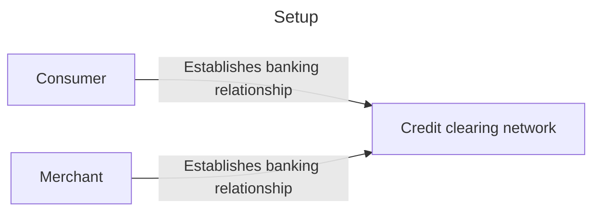

How well do you kow what money is? We will explore a few intuitive things that money is, break them down, and then see how Bitcoin and tokens on blockchain are so much different.

I usually present this topic as part of a workshop, to people having any or no experience whatsoever in blockchain. Draw on your own life experiences—that is an important part of connecting with the content here.

## Let's buy a coffee

We're at a cafe and we want to buy some coffee. Let's go up to the barista and make an order.

How do you want to pay?

And how does that work?

And how does it really work underneath that?

We can take this in a few directions, depending on the audience. But here are a few common ones...

## Pay by credit card

A credit card transaction works by having a consumer and merchant establish mutual banking relationships through a credit clearing network, Visa is the largest.

This credit network is situated on top the normal banking and payments structure for commerce in any given currency.

After the relationships are established, payments can be sent from the consumer to the merchant.

**Is this your money?**

Are you able to spend it? What if you want to spend it on lottery tickets or marijuana (if and where legal)?

The clearing network, your bank, the merchant's bank, and myriad other intermediaries can deny this transaction.

So, again the question is: if you require sign-off or permission from other parties to spend it then is this really your money?

## Debit, checks

Debit, bank drafts (i.e. "checks"), money orders, cashiers' checks are all just more instruments of the same system.

## Cash

So what about cash. Or "hard money". We are talking about US dollars, federal reserve notes, or gold coins.

Now we're getting closer.

If you want to use cash to buy lottery tickets, and this is a consensual transaction. Is that really money? Can anybody stop you and the consensual partner from transaction?

What if you want to buy a boat? A ship? What if you want to go to Europe (or the US, if you're already in Europe) and you want to buy a ship with cash. Can you do that?

What if the ship costs this much. Now I take out a ridiculous amount of cash from my wallet on stage.

What if the ship costs this much, can I take this much to Europe to buy a ship?

Now I take out an even more ridiculous amount of money from my wallet. Definitely more cash than you've ever seen anybody take out of a wallet before.

...

## No spoiler

Every time I give this speech, SOMEBODY in the class knows the answer to this last question. And they know the EXACT answer.

Most recently in Tallinn, Estonia I was giving a preview of this talk to an audience of two people. And I even jinxed it by bragging that SOMEBODY ALWAYS knows. Any somebody said "I don't know". Sure as day, the other person knew.

## Tokens

Okay, now let's move on to tokens. Basically for this, Bitcoin and blockchain tokens (e.g. living on Ethereum Mainnet) are the same thing.

So let's look at how they work.

I drag out this slide as three different slides. But bear with me, I'll type it out.

1. The issuing party (looks like a bank here) creates a token
2. The token grants it to somebody
3. That somebody gives the token to somebody else

And that's it!

This step three is fundamentally different than how money works. And it one reason a lot of people got excited about Bitcoin in the beginning.
