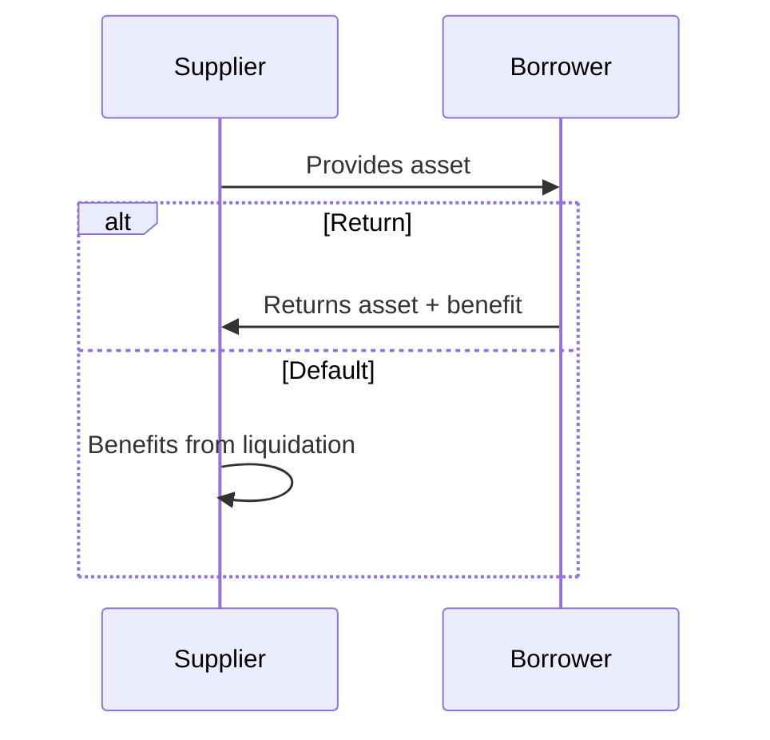
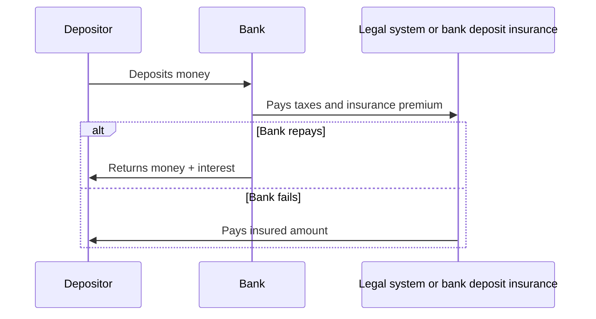
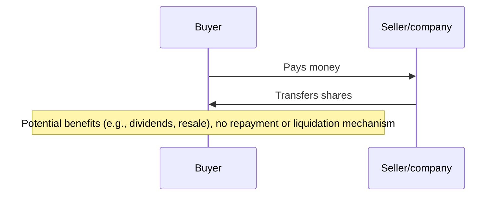
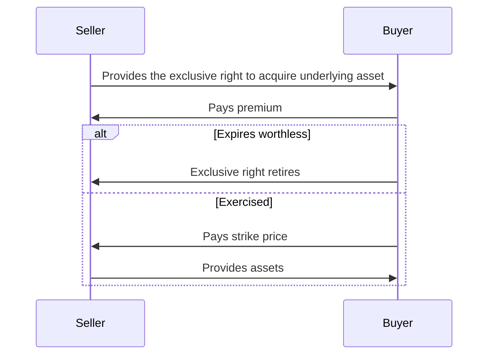
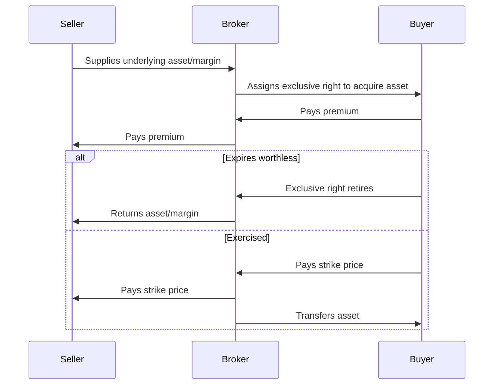
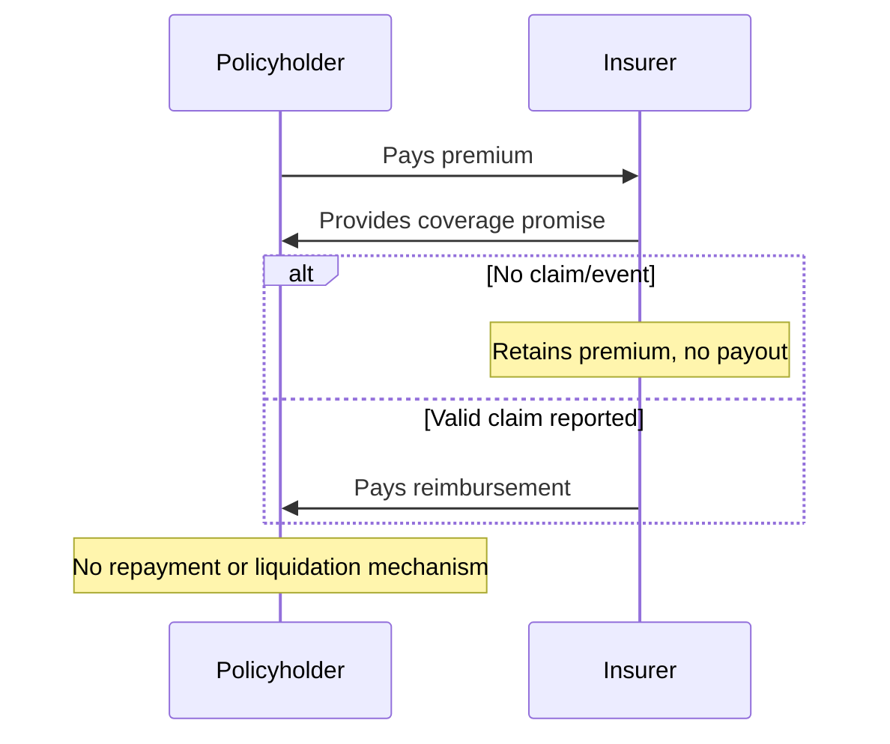
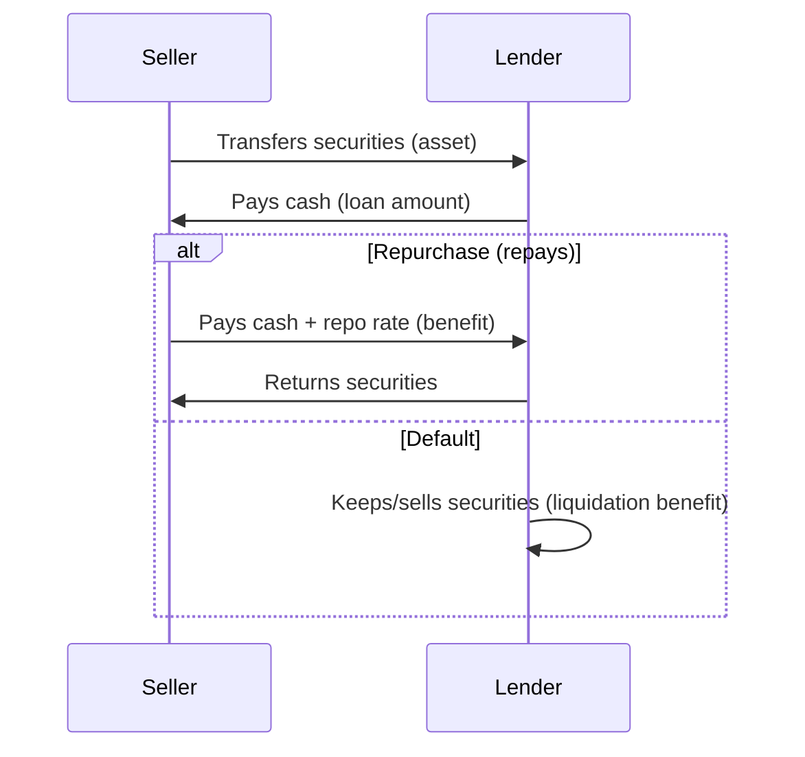
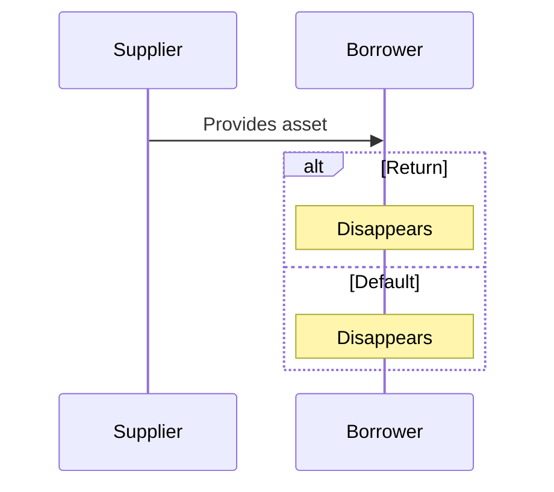

Finance has one core functionn: asset supply, asset lending and liquidation, all tied together. In this article we test this definition of finance, show that nothing else is actually finance and look forward to how traditional finance and decentralized finance, DeFi, (e.g. on blockchain) implement this core function.

This is a first principles look at finance.

## The core lending primative

Finance provides a basic function in an economy, which is the supply/lending of assets, backed by the threat of liquidation. This is a trifecta. If any of these is missing, you are not talking about finance, you are talking about something else.

Let's see it!

- **Supply**: a **supplier** provides an asset, expecting that asset back and some additional benefit
- **Lending**: a **borrower** receives the asset, expecting to return it and provide some additional benefit
- **Liquidation**: in the exceptional case that the borrower does return the asset, the supplier shall have some other alternate benefit

This diagram shows the prototype of everything in finance. Depending on how the liquidation works, or what third parties are involved, you may see different names and details. The names and details matter, because they often define what laws and regulations apply. <mark>In finance, something can be legal or illegal based on what you name it!</mark> So pay attention.

Let review some examples of applying this core function. *And while we're doing this, keep in mind that DeFi (e.g. on blockchain) only sees tokens and rules-based systems—it doesn't care what the names of things are. If two things are the same, but use different names, DeFi can just substitute one for the other.*

### Example: bank deposit account

A bank deposit account is a classic example of these three primatives. The supplier is the **depositor** who **deposits money** to the bank. The borrower is the **bank** which receives the money and promises to return it on demand, plus some **interest** as benefit. The liquidation is typically well-defined, through **legal systems and bank deposit insurance**. This finance function is offered by a bank, and they are the second party to the agreement. The bank pays the legal system or bank deposit insurance some taxes and/or premium in this scheme.

Sequence diagram

### Non-example: purchasing equity shares

Purchasing equity shares in a company does not constitute finance under this core definition, as it misses the lending and liquidation pillars of the trifecta. An investor exchanges money for ownership—a "thing" granting potential benefits like dividends or voting rights—without any structured repayment or alternate benefit on default. These benefits, whether monetary or otherwise, are not fundamentally different from those derived from buying a portion of a church, a country club membership, or even an orange tree that yields fruit; all involve risk, time value, and possible resale, yet none inherently qualify as finance. Labeling such transactions as "finance" often serves to inflate sophistication, but they are merely asset acquisitions or brokering.

Sequence diagram

### Example: selling a call option

Selling a call option embodies the core finance function, fulfilling the trifecta of supply, lending, and liquidation. The supplier—**option seller**—provides the right to buy an underlying asset at a set strike price, expecting to keep the **premium** as benefit if unexercised. The borrower—**option buyer**—receives this right, paying the premium upfront with the intent to **exercise** if profitable. Liquidation triggers upon exercise: the seller delivers the asset and gains the strike price as alternate benefit, distinct from mere asset exchange. This structure mirrors the unique baseline of finance, where benefits arise from timed obligations and risks, not speculative ownership.

Sequence diagram (simplified)

There are a couple important notes about equity options. In order to properly write a call you must own the underlying asset. And you must deliver it to a brokerage. And during the time that your call is active, you are unable to remove your underlying from the brokerage. If the equity produces dividends, you receive them. In other words, you do not own the asset at that time. Tax rules and accounting rules in many (all?) jurisdictions ignore this ownership concept, but the below diagram does not.

Sequence diagram (actual)

This "actual" diagram shows both sides with the broker in the middle. Each leg of the transaction is a separate finance function. And the broker, as the holder of the underlying asset (also known as an **owner** for some definitions of ownership), participates in both legs.

### Non-example: home insurance policy

Ben Franklin founded a fire insurance company, the Philadelphia Contributionship for the Insurance of Houses from Loss by Fire in 1752.

At this time of its founding, this was not contemporaneously considered a finance function. And according to our core definition of finance, it still is not.

Sequence diagram

Now, an important note, and specifically about this 1752 insurance company (still operating today). They do offer a perpetual policy, you pay a premium as a deposit and they do provide coverage as long as your deposit is with them. You can demand your deposit back and you lose coverage. Such a perpetual policy defeats this classification here and indeed is a finance function.

### Example: repurchase agreement (repo)

This is a staple short-term funding tool, often used by banks or institutions. It fits the trifecta perfectly: a **supplier** provides securities (asset), a **borrower** receives cash (using the asset as collateral), with **repurchase** as repayment plus interest, and **liquidation** via keeping/selling collateral on default.

Sequence diagram

The reading circle question here is which entity is the supplier and which is the borrower?

The economic reality of a repurchase arrangement is equivalent to a pawn brokering arrangement. Tax and regulatory treatment for these two scenarios very wildly. And typically matters such as classifications of the underlying asset have an impact on which rules apply.

## Onward with DeFi

Decentralized finance, DeFi, typically implemented on blockchain, can implement the analog of core finance functions using tokens and smart contracts.

Let's see how the minimum core function of finance applies in DeFi.

Since we are considering "decentralized" applications, we will assume that parties do not have legal recourse to each other. <mark>Using the same basic implementation breaks down quickly</mark>:

In [the next article](2025-12-30-one-core-defi-function.md), we build up the minimum implementation of finance using DeFi tooling and study its utility along with other blockchain token application patterns to see if they meet our core definition of finance. We then examine [DeFi primitives for real world assets](2026-01-04-defi-primatives-for-rwa.md) (RWA) onchain.

## Further reading

Our loan-only definition of finance resonates more hundreds of years ago. But for modern works, see: Joseph Schumpeter (1910s) and John Gurley & Edward Shaw (1950s) various works on role of finance in the economy and their definitions.

This first principles are important to understand as we build DeFi and new financial systems.

## Footnotes

1. We define the **owner** of an asset as the exclusive entity that may decide to burn/destroy a thing without recourse to anybody else.
