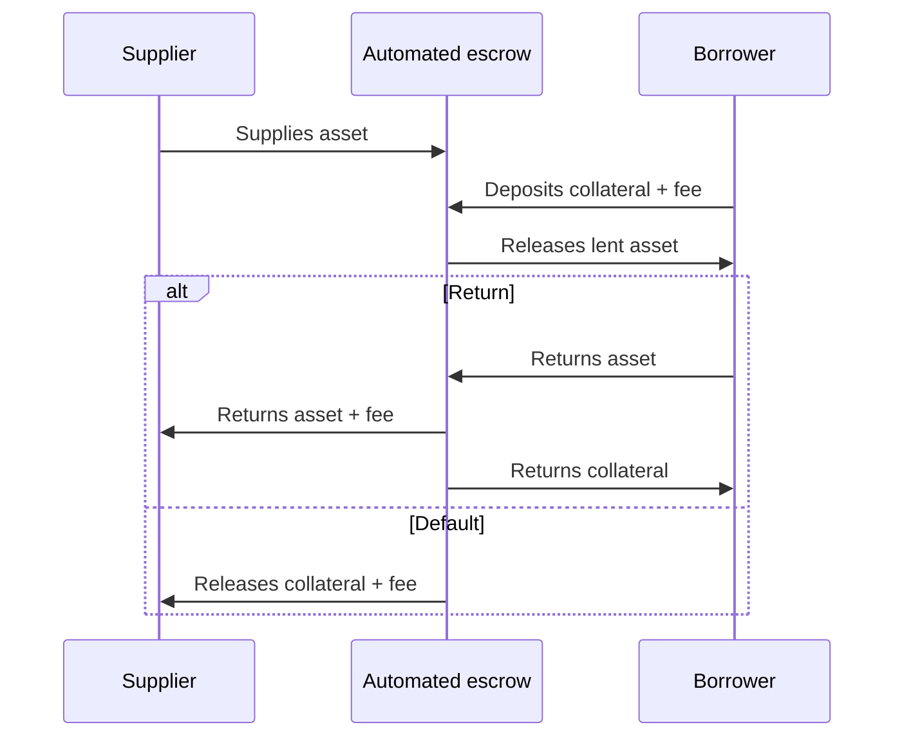

In [the previous article](2025-12-20-one-core-finance-function.md), we established a first-principles definition of finance as the trifecta of asset supply, lending, and liquidation. This core function contributes to an economy by allowing assets to be temporarily transferred with built-in mechanisms for repayment and recourse on default. We examined examples like bank deposits and repos, as well as non-examples like equity purchases and basic insurance, to illustrate the boundaries of this definition.

At the end of that article, we naively considered a two-party lending scenario on blockchain. But quickly we found that it doesn't work as-is, because in a decentralized, permissionless environment, when you transfer an asset to a borrower, they can simply disappear without repaying the loan. You have no recourse. And therefore that is not finance.

Let's go ahead and construct the minimal implementation of this core finance function using blockchain. Then we can examine its contours, and see if other shapes are possible.

## Seeking the minimal DeFi implementation of the core finance function

To viably implement the core finance function on blockchain, we must employ a rules-based system that can hold assets in escrow. On an account-based blockchain, smart contracts provide this ability.

First, notice how the order of operations matters, all deposits must be secured before any assets are released. This model is very similar to the traditional finance of selling a call option, but the individual steps are slighly reordered.

## Rational actors

Let's think why the supplier and borrower would agree to this arrangement. First let's consider if the actors don't care anything about the asset, or the collateral, and only care about profit.

- The supplier will expect to receive a fee ("interest") for lending out their asset. And they accept some risk that they may not receive their asset back (probably if the asset value skyrockets).
- If the borrower only wants to use the asset for profit, they would be happy to join this arrangement if they expect the value of the asset to drop more than the fee they pay and the opportunity cost of their collateral.
  - Pay some collateral.
  - Borrow asset, sell it.
  - Buy it back cheaper, return it.
  - Pay fee, get collateral back, keep net profit.
- The asset may generate valuable consideration throughout the duration of the scheme, and this would impact the rational calculations of both parties.

Other rational benefits are possible:

- The asset may provide some utility to the borrower: access to a party, authority to participate in a game.
- The asset may comprise some negative-value liability or carying cost. Transferring it may relieve the supplier of this burden.

Although other rational benefits are possible, my experience is that the vast majority of transactionss following this pattern are motivated by profit. And the vast majority of the underlying value are blockchain tokens, whose value is primarily derived from fees from people who make these speculative transactions.

## Basic variations to this flow

Many details can modify this basic implementation to get interesting new applications:

- The supplier and/or borrower may preauthorize the terms of some agreement ("be a maker"), inviting anybody else to immediately consummate ("be a taker").
- The escrow may send the fee to the supplier immediately when the borrower deposits it, drip it over time or send it all at the end.
- The escrow may accept collateral some kind of collateral from the borrower and use the open market to satisfy what the supplier requires.

## Auto-rolling loans

Most people that use blockchain and token markets on them will be familiar with the auto-rolling loan.

To realize auto-rolling, the supplier and the borrower agree on a collateralization ratio rather than a specific performance of collateral. "Collateral of XXX% the market of the lent asset shall be on deposit." If the borrower is undercollateralized then the lender may liquidate to receive the impaired collateral.

These systems typically allow anybody to initiate the liquidation. And that is why things blow up spectacularly around market corrections.

## The funny thing is centralization

Platforms such as Compound and Aave implement the repricing of loans by working as a special participant in the system. The monitor different marketplaces and publish interest rates into the smart contracts. This completely undermines the definition of "decentralized" in DeFi. And it typically allows this party to take all of the assets out of the system if they wanted to. All they need to do is make one new kind of asset, own all of that asset and tell the system that asset is worth infinity. Then borrow against it. Game over.

This centralized lending application is the main thing that people call "DeFi" today.

## Other applications

Several other applications on blockchain are notable. Let's see if they fit our definition of finance and other ways we can review them.

### Example: decentralized options protocols

These protocols allow users to sell options by supplying rights (via tokens), with exercise as "repayment" and collateral liquidation on failure. This fits the trifecta of supply, lending, and liquidation. See also our note that options ARE a finance application.

### Non-example: NFT sale marketplaces

Buying/selling NFTs is asset transfer, like equity shares—no lending or liquidation. Therefore, it does not fit our definition of finance.

Take special note of one kind of application, when an NFT is supplied or used as collateral in finance, but where a different NFT from the same collection or meeting some specific criteria is accepted as a replacement to unwind the position. A similar approach is when you make open-ended floor bids for an NFT collection (regardless of which specific NFT you will get), and then somebody incentivizes you for being the highest bidder.

These two adapters allow NFTs to work with liquidity pools.

I've seen so many people propose NFT lending, and some companies even tried it. Doing that would really bastardize the artwork that some NFTs represent. But I do note that nowadays, Blur and OpenSea would probably make more money with this product than their current offering.

### Non-example: decentralized exchanges (DEX) e.g., Uniswap

A decentralized exchange is a marketmaking system governed entirely by pre-arranged rules. Assets of two or more types are collected. And the then the system allows anybody to swap between the assets according to the rules. Swapping the assets affects the price according to supply and demand.

There are several ways to look at this system. If you are interacting with it to buy or sell tokens, you are simply trading assets. This is not a finance function.

But if you look at it from the other perspective, people that supply the assets, then yes it is a finance application. Those people can retrieve their assets plus fees later. Or if the assets are not there their alternative benefit is the other assets in the pool.

### Equity-like investments

Direct purchase of an equity token is not finance. Even if that token entitles you to receive dividends or other benefits. Because the transaction is fundamentally identical to purchasing bread, or an orange tree that yields fruit.

Blockchain tokens that cover ownership in a enterprise will be a major blockchain use case going fowrard. And there are many reasons to watch this space for future developments.

## Next steps

In [the next article](2026-01-04-defi-primatives-for-rwa.md), we examine DeFi primitives specifically for real world assets (RWA), including custodial considerations and unique primitives for profit-generating enterprises and crowdsales.
