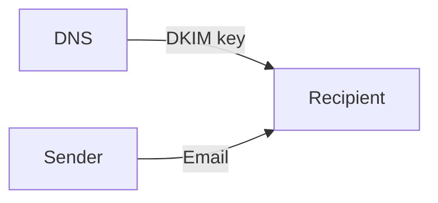
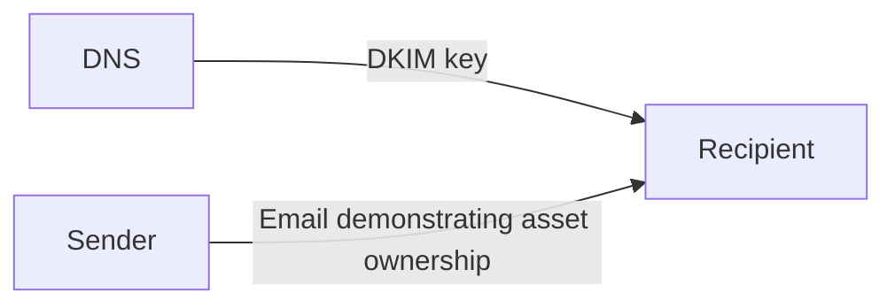

*This paper provides a technical explanation of how to send blockchain tokens only to verifiable US citizens. It runs entirely on-chain and is trustless. This approach scales to other jurisdictions and other verifications, and it does not require cooperation from government.*

In the age of the airdrop, projects wanted to create a token and then give out a limited supply to: special people on GitHub, special people on X, other named individuals.

But each one of these was implemented the same way: some person creates a bunch of tokens for themself, they set up a webserver, and you that webserver may decide to give some of the tokens to you. You login using GitHub or X or whatever.

**You** were proving to the **project owner** who you are and the **project owner** gave you tokens.

System-wise and security-wise this is not interesting. It is a trusted system. They could give the tokens to themselves or anybody.

But a few cryptographic primatives in wide use today allow us to do trustless verifications for some interesting attestations.

You can create verifiable proofs of asset ownership and identity without showing that identity to anybody. Let's see!

## Email DKIM primative

Email already has domain anti-spoofing checks. Here's how that works.

1. A sending domain DNS entry recognizes a specific server as authoritative (e.g. Google Workspace)
2. The email sending system publishes DKIM records, e.g. `20161025._domainkey.gmail.com`
3. Sent emails are signed using this key.
4. The recipient verifies against this key and concludes the email is authentic from the sending domain.
5. **If the email is published, anybody can trustlessly verify it is authentic from the sending domain.**
6. **If you publish the email first, you can reasonably demonstrate that you initiated that action.**

When we say to "publish" the email, this means the full email including headers.

## Filesharing primative

InterPlanetary File System (IPFS) and the Solana blockchain both use the same Ed25519 key pair and can cross validate identities.

- A person publishes to IPNS with any standard Ed25519 key.
- Anyone can resolve the IPNS to get the full public key (use `ipfs name resolve`).
- Convert that public key to Solana’s Base58 address format (one-line of code).
- Identify if that address is active on Solana and send them tokens.
- The person who controls the IPNS private key can use any SOL or tokens immediately.

This works today, you can tokens directly to anybody who publishes on IPFS/IPNS.

Working the other direction, you can also check the online/offline status and IP address of such people that are using Solana.

## GitHub SSH key primative

You can use the GitHub API to lookup the public keys for me or anybody using GitHub.

`https://api.github.com/users/fulldecent/keys`

You can use this approach to allow arbitrary GitHub accounts to login to a system you created. Ubuntu has a nice setup process when you create an account: provide your GitHub username and it sets up public-keys to login to your account.

With a blockchain smart contract, you can preauthorize a list of these keys from targeted GitHub accounts. Then those people can sign a message that is verified on chain. No webserver required, no middleman.

## Use case: proof of billionnaire status

From the email primative, we can parlay this with the fact that investment brokerages will send emails including account details to beneficial owners.

If you publish this email, this can trustlessly verify that you own a specific asset. Anybody can take your email, verify its authenticity against the brokerage DKIM key. And if they agree that the brokerage sends emails only with factual information, then they can verify the documents without needing to ask the brokerage directly. (They can also see your email address, but we can fix that.)

If you redact the email (or, lol, just post a screenshot) then the public can no longer validate it against the original DKIM cryptographic signature, anybody could have produced that screenshot. But zero-knowledge proof systems exist where you can *describe* the important parts of the email and it will give a non-repudiatable evidence rather than publishing the full email. For example, you could prove:

- The DKIM key
- The email sender
- A blinded one-way token of your recipient email address or account number
- Specific text in the email, such as "Account: balance..." for a specific template
- Zero-knowledge proof demonstrating the full email matches and authenticates as claimed

### DAO for billionaires

This means you can create a fully-decentralized self-attested club for billionaires. A decentralized program (DAO) will come preloaded with specific acceptable banks/email templates.

Anybody would just need to produce a valid email attestation showing an account balance and their account number/email address was not previously used. And the DAO admits you as a member.

## DAO for citizens or voters

I live in Montgomery County, Pennsylvania. If you register as a voter with online mailer service, you will receive an email after your ballot is received.

Using the same approach, it is possible to create a DAO, where anybody (at least MontCo voters) can join after providing anonymous proof that they voted on national election day.

This same approach can be used for other government identity and action receipts which you receive over email.

The entire system is trustless, and can be done anonymously on blockchain with a DAO.

The end result is a blockchain smart contract that trustlessly gives tokens only to US citizens.

You could of course do other countries.

## Prove off-chain activity

This same email trick allows you to demonstrate ownership of X accounts, ownership of various other online identities, and actions of various kinds across various real words activities.

I haven't built any of these systems. Because the world isn't ready for this future yet.
