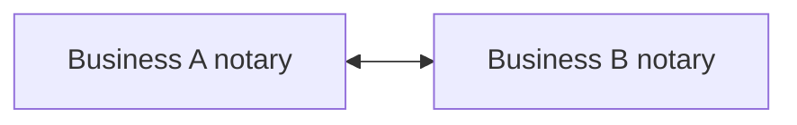
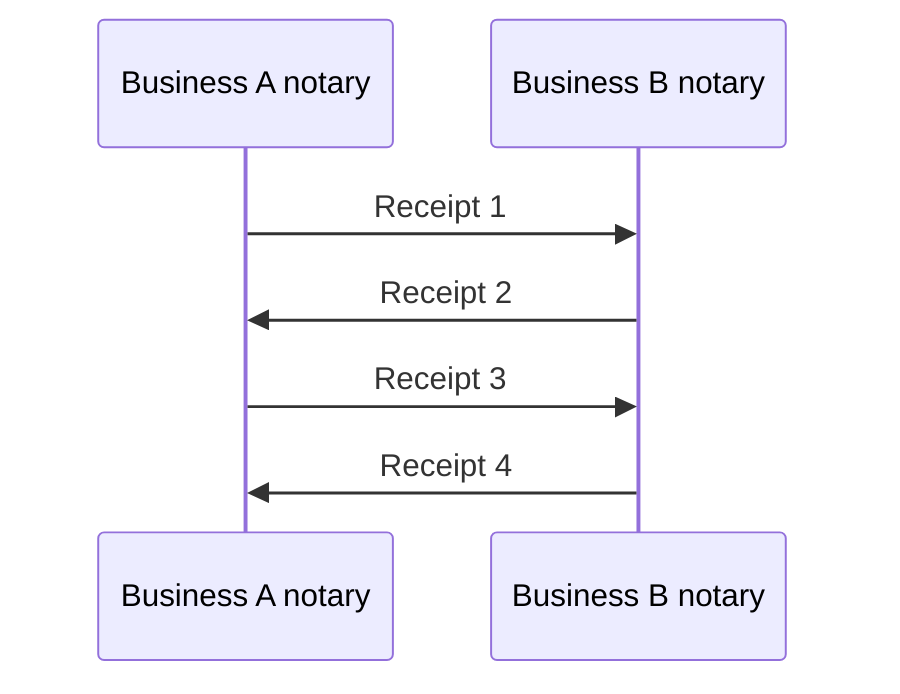
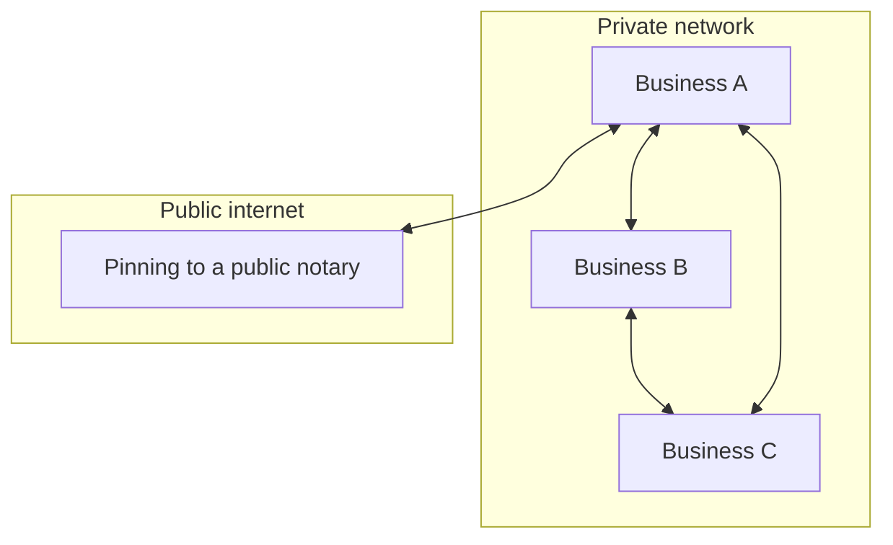

## Notary pairs: immutable, mutual timestamping service for business relationships

You created a document today.

When you deliver that to your business peer, you want confirmation that they received it and when. This includes emails, electronic document interchange and other business processes.

One solution is to ensure that all business processes go through email, and that read receipts are always on. And that you check the receipts.

Another extension of this technique is "notary pairs". This approach applies to more kinds of data/processes and borrows from blockchain and [versioned database template](https://github.com/fulldecent/versioned_database_template) concepts.

## What is a notary pair

A notary pair is a mutual, ongoing, connection established between two entities that notarizes documents. These will typically be used by businesses.

They are synchronized and create an immutable ledger of document receipts.

Each entry contains exactly:

1. **Incrementing serial number**, e.g. 1, 2, 3, ...
2. **Timestamp**, also strictly increasing
3. **Prior entry hash**, a succinct calculated summary from the prior entry
4. **Payload**, typically a hash of some file or business record
5. **Signature**, of of the notary making the entry
6. **(Optional) pentultimate signing key and new signing key**

This is managed by an agent run in each entity's system.

## Zig-zag etiquette

This system is designed as a zig-zag protocol where odd-numbered entries are from one side and even-numbered ones are from the other. If a participant wants to send a payload but it made the last turn (i.e. not its turn), then it politely asks the counterparty to create a empty-payload message. And then the microphone passes back.

Each notary enforces the rules and will not accept if, for example, the timestamp is in the future, prior entry hash is incorrect, other partrs are invalid.

And they use this approach back-and-forth to record all business records.

## Privacy

You connect to other entities only by explicit configuration on both sides. All data is end-to-end encrypted through both sides.

## Plausible deniability ratchet

You may rotate your key on each turn with the optional "pentultimate signing key and new signing key". In this case, you and the counterparty will each know your connection is still secure and still know that the prior messages have not been tampered with. But it adds something new.

If anybody (you, the counterparty, or a third party that somehow got access) tried to publish the event stream, they would also necessarily be publishing the signing keys for each event (up to the most recent one). Therefore, no third party can authenticate that these messages are authentic.

It would be like if you walked into the bar with an ID card, and your ID card was stapled to a fake-ID-card printing machine!

## External time synchronization

You may synchronize your entries with external timestamping services ("public notary") if you care about proving *when* certain messages happened.

Include the most recent Bitcoin network blockhash as part of any event payload. This proves your event was created at some time after that Bitcoin block.

Include a copy of any event and publish as part of a Bitcoin event. This proves your events was created some time before that Bitcoin block settled.

## Smart contracts

The entry payloads may also include other protocols such as Ethereum Virtual Machine code.

If the notary is configured to reject messages that do not follow the specified protocol then this can maintain a mutual smart contract ecosystem.

## A network of peers

This approach also scales to a network of peers.

Remember that when Business B and Business C communicate in this example, they cannot messages they have seen (through Business A) regarding the public notary. If ratcheting is used, the messages they see through Business A may be a forgery of the public notary's mesages!

The notary pairs system only guarantees security between relationship pairs. It does not establish stable public identities which can be gossiped between entities.

## The limits of channels

**Public identities are not supported.** In this topology of pairs:

The notary pairs system only guarantees security between relationship pairs. It does not establish stable public identities which can be gossiped between entities. For example, Business B and Business C cannot validate any message regarding the public notary which they have seen through Business A. Recally that if patcheting is used, Business A is fully able to delay and forge messages from the public notary and feed them to its peers. They will be none the wiser.

**Credit systems are not supported.** It is well established that any credit instruments only works if there is a publicly visible collateral. And debts against it are only truly enforceable if they are publicly recorded against the visible collateral. This is how layer-two networks ("channels") such as the Lightning Network are able to efficiently move Bitcoin. They:

1. Publicly secure an asset (e.g. some Bitcoin)
2. Do things
3. Release the asset

This system only works because everybody can agree that no two overlapping debt instruments are outstanding against a given Bitcoin.

Furthermore, if you are using the ratchet privacy option, you can't be sure that any gossip you see outside of your own channel is genuite!

## Conclusion

This system allows any business relationships to benefit from mutual message/document timestamping. This effectively prevents any dispute of document receipt and he-said/she-said timing. It scales to arbitrary kinds of documents and online network access.
